# HTTPS中的证书初探

## 简介

证书是什么？我们为什么需要证书呢？HTTPS中的证书是干什么的?带着这些疑问我们讲了解一下证书。

​		现在互联网时代，各个终端都在相互通讯中，每秒都会有亿万的信息被传递着。但是这些交互的信息有的十分重要，如果不加保护，这就有可能导致被截获甚至篡改，导致了不可期望的事情出现。举一个简单例子，当我们用手机银行转账的时候，请求银行的服务器，发送转账相关请求消息金额账户什么 的。如果传递给银行的服务器的消息被截获篡改且不被发现这就便十分危险，如果把金额和目标账户修改后，我们就会受到损失财产。我们先详细的阐述一下我们在通讯的过程会受到什么样的攻击。怎么面对危机是我们将要解决的主要任务

## 通讯中的杀手：中间人攻击（Man-in-the-middle attack）

​		我们和别人通讯的时候 肯定不希望有任何人来打扰我们或者是恶意修改我们传递的信息，这就是要防止中间人攻击。我们上面举得那个转账的例子就是 属于中间人攻击的一个例子。

什么是中间人攻击呢？

​		我们一般通讯的时候需要的是两端，好比服务器和客户端。攻击者在这两端中间，传递转发消息。在这个过程中会查看我们的消息甚至做出 修改，来危害我们的通讯安全。我们现在尝试突破中间人的攻击。

我们使用图示演示一下中间人攻击，本来AB之间通讯的挺好的，忽然来了一个**攻击者C**,潜入到了他俩通讯的中间，进行信息的拦截和转发。

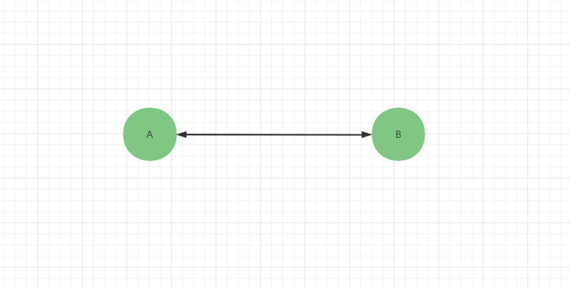

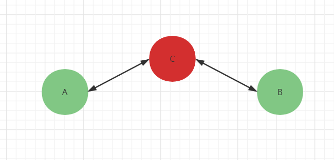

​			攻击C的潜入让我们的通讯变得无比不安全，首先我们通讯内容全被他看到，而且有可能修改我们传递的信息，我们还发现不了这就很危险了，就像上面我们那个转账的例子。

​		攻击c的主要任务是和A通讯的时候模拟B,和B通讯的时候模拟A。是A和B都无法真正的发现。我首先想到解决方案就是加密，我们怎么加密呢？

​		如果我们使用对称密钥进行加密，如果A把要加密的密钥发送给B，然后双方使用加密。但是这明显不行，密钥同样会被劫持到，甚至给你替换掉。

​		那我们使用公钥加密的呢，双发都发给对方 公钥，然后对方就是用公钥加密，收到消息用自己的私钥进行解密。

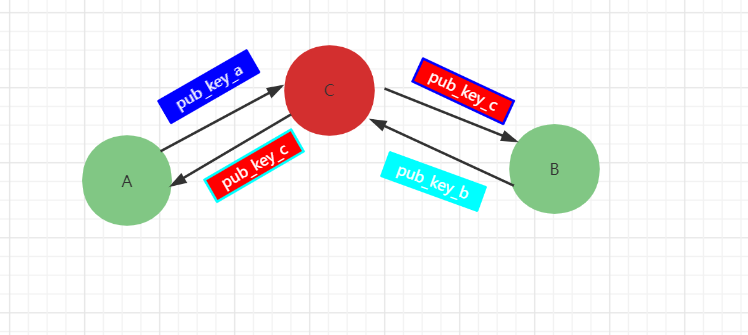

邪恶的攻击者C呢，就会把自己模拟称成对方想要通讯的一方，把自己的公钥传递给对方，保存发送方的密钥。比如A想把自己的公钥pub_key_a发送给了B，结果攻击者C在中间替换成自己的pub_key_c了，并记下pub_key_a。B像发送的自己的公钥pulic_key_b，C也会做同样的操作。

​		这样AB都会用pulic_key_c进行加密，攻击者C当然会使用对应的私钥进行解密这些信息，并作出修改，然后使用pub_key_a加密发送给A或者使用 pub_key_b加密发送给B，这样的话AB双方都不会发现他们信息被拦截修改了。

​		很明显使用公钥加密无法防止中间人的攻击，对于使用公钥加密算法去协商密钥的做法，也会像上面一样，攻击者C模拟通讯双方的行为，来达到中间人攻击的效果。

​		我们怎么防止中间人攻击呢?这里面有一个很明显的点，就是如果我们知道这个公钥是来自于理想的对方这一切都就会解决。怎么保证我们接收的公钥来自理想的对方呢？那就是**证书**。

## 怎么保证通讯安全：数字证书

​		https中的使用SSL或者是TLS协议来保证通讯安全，防止中间人攻击的。SSL或者TLS协议就是使用的X509证书来保证公钥的是来自期望的一方。https就是保证 http安全通讯的，它其实就是在http和tcp之间增加一层协议来保证通讯的安全。

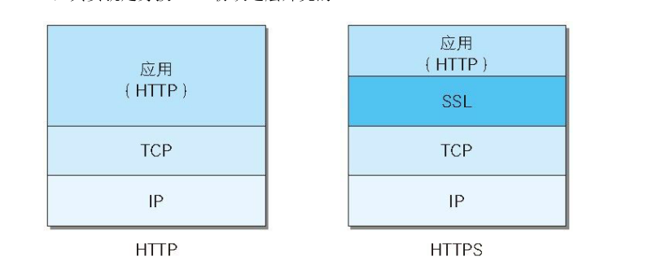

​		我们先了解一下证书的样子，证书里面的信息有公钥和签名等相关信息。如果我们想把自己公钥交给对方使用，现在都是把含有自己公钥的证书发送给对方，对方会检验证书是否是信任证书。

​		证书里面是什么样子呢？证书又是怎么保证安全的呢？

证书的核心部分是一把公钥和签名还有一些信息（公钥用途、过期时间、签发者信息、拥有者信息、废弃列表等等）

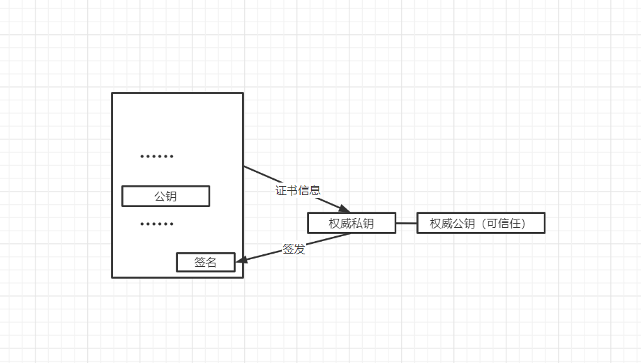

​		证书里面的**签名**就是使用某一个**权威的私钥**（权威机构拥有，去签发可以被大家信任的证书）对公钥和其他信息进行签名，怎么验证证书的是可信的没有被修改的呢？当我们通讯的时候拿到对面传递来的证书的时候，假设我们有一把可信任的公钥（也是权威私钥对应的权威公钥），去进行验证签名，如果验证通过就保证这个证书可信且没有被修改的，是我信任的权威私钥签发的，这就是使用的是签名的不可修改性和不可抵赖的特性。

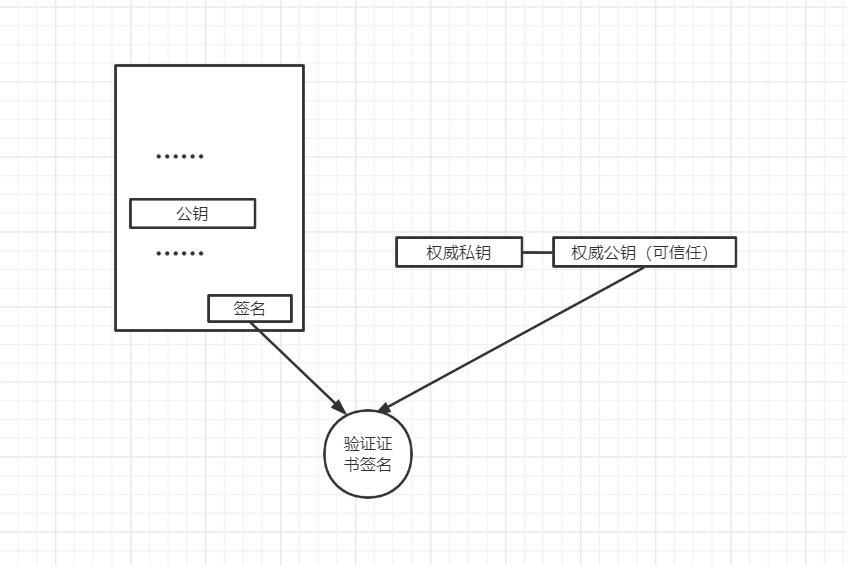

​				现在问题就来了，我怎么拿到这个可信任的权威公钥呢？其实这个公钥也是在证书里面的。这个证书就是我们已知的信任证书，一般这些证书的公钥都是用来签发其他证书的，就上面上面证书的生成一样。证书的签发都是有一些专业的权威机构进行签发，再把他们签发证书相关的公钥用证书的形式公布出来。像我们浏览器啊，系统啊就会内置一些权威机构的证书，当然我们也可以手动添加我们所信任的证书，证书所包含的公钥可验证权威机构所签发的证书。

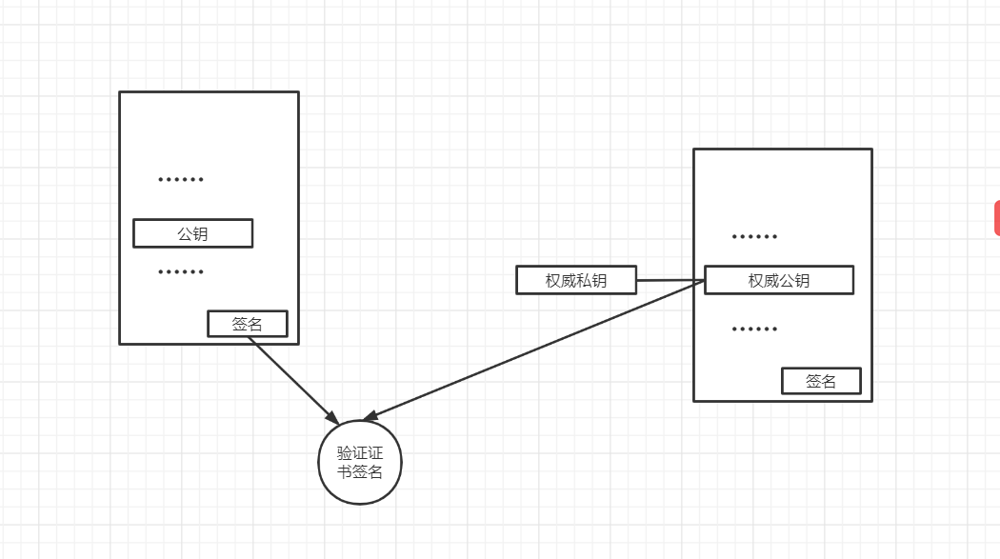

​		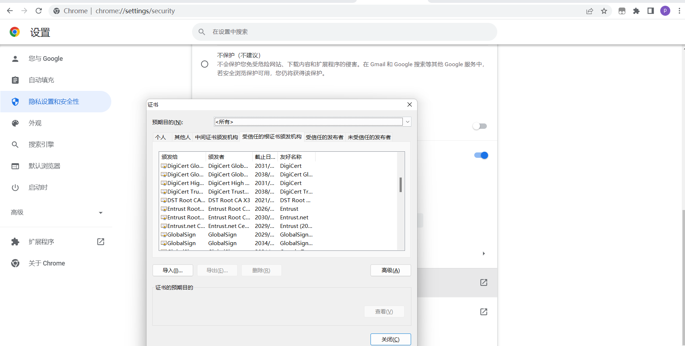

如果我们想要拥有其他人可以信任证书，我们就得去权威机构提供相关信息签发证书。

​		在权威机构内部也不是 只能有一个证书去签发用户来申请的证书，他们会有一些不同部门，不同部门处理不同的证书签发。这些部门都会有一个可以签发的证书。每一个部门的证书都是由权威机构里面的一个核心证书签发，这样就会形成一个树状结构，这个证书就是根部证书，那么根部证书又是谁签发的呢？根部证书是有自己签发的，没错，和他下一层的证书使用相同的私钥签发，这种自我签发的证书称之为**自签证书**。

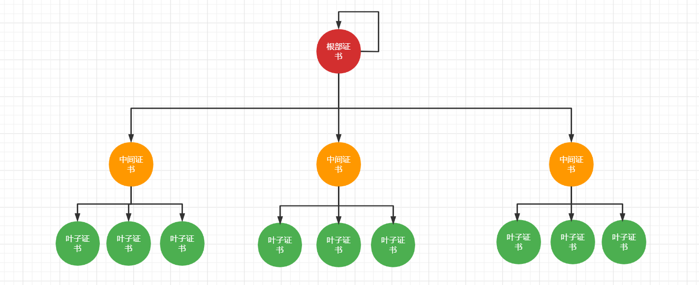

​		最终的叶子证书我们将会颁发给证书的申请者使用 ，当我们在使用这些由专业的权威机构的签发证书时候，我也必须拿到这些中间证书，形成一个证书链，因为在认证的过程中，只要信任这个根部证书，通过传递验证的方式我们最终就能验证我们使用的叶子证书（也可认为是终端证书）可不可信，如下图。

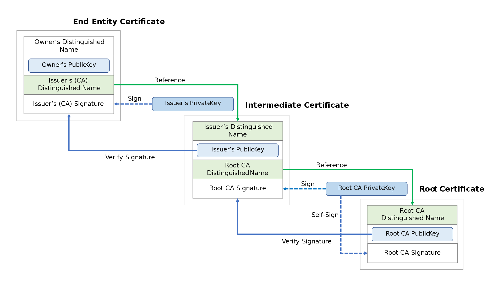

我们使用Https的安全通讯协议传递证书的时候也是发送给对方一个证书链，对方通过根部证书就能校验最终的叶子证书可不可信。

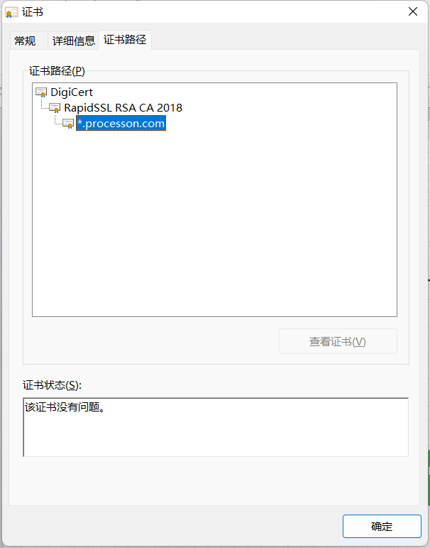

我们抓TLS协议的包再证明一下。

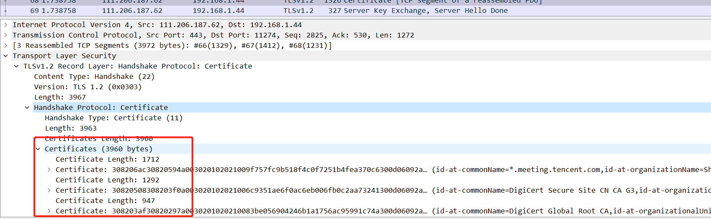

​		其实我们光有证书还是不够的，还需要有专门的安全协议像TLS协议，来使用我们的证书进行握手协商，来写出一个或者几个密钥。进而保证我们通讯的安全。

## 总结

​		今天我们明白了通讯过程中我们将会面对各种各样的攻击，其中最令人深恶痛疾的是中间人攻击，中间人攻击，通过模拟通讯双方的行为，来达到对通讯信息的修改，还让通讯双方不能发现。这种攻击将会造成很大损失。

​		我们在解决的时候发现公钥加密算法，可以不用传递要可以解密的私钥就能达到加密的效果，但是传递公钥的时候 依然可能被攻击者模拟通讯双方，依然是不安全的。

​		证书的出现解决了公钥来自可信任的对方，这就需要我们有一个可信任的签发证书的机构，进行签发。签发机构有很多部门可以签发证书，不同部门有不同的签发职能，这些部门的证书是由他们自己内部的根证书来签发的。

​		这将会形成证书链，我们在校验的时候使用是根部证书去校验，在TLS协议中是传递的就是证书链。这样我们就可以只信任某个签发机构的根部证书，就可以认证这个机构所有签发的证书。

​		下面一篇文章我们将会深入的了解X509证书，在面对 一些其他的问题时，证书是怎么就解决的？比如证书失效，证书的校验等。

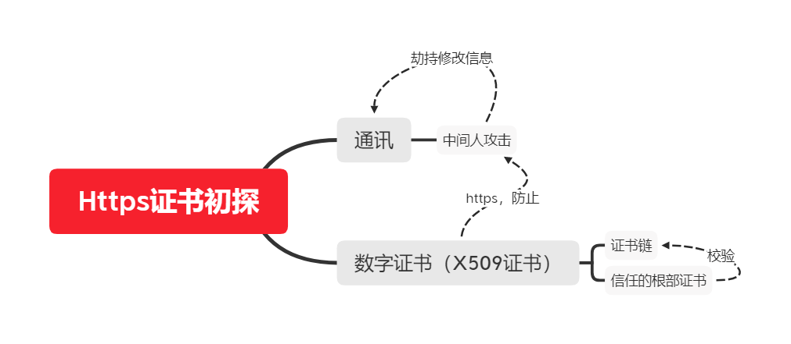

