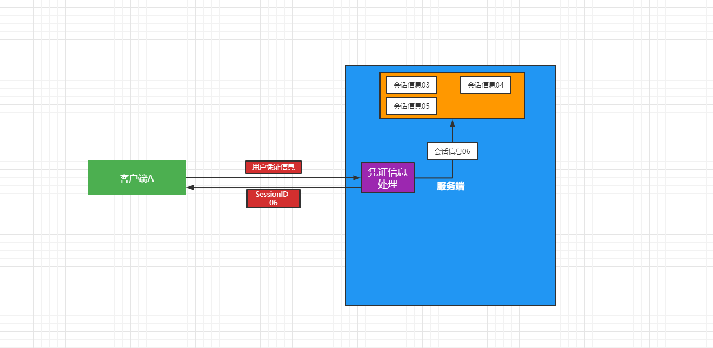
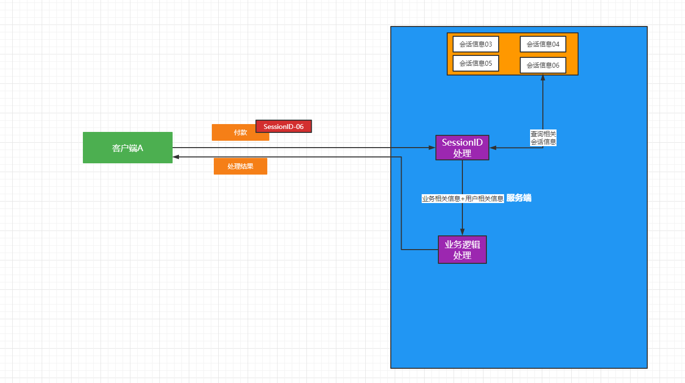
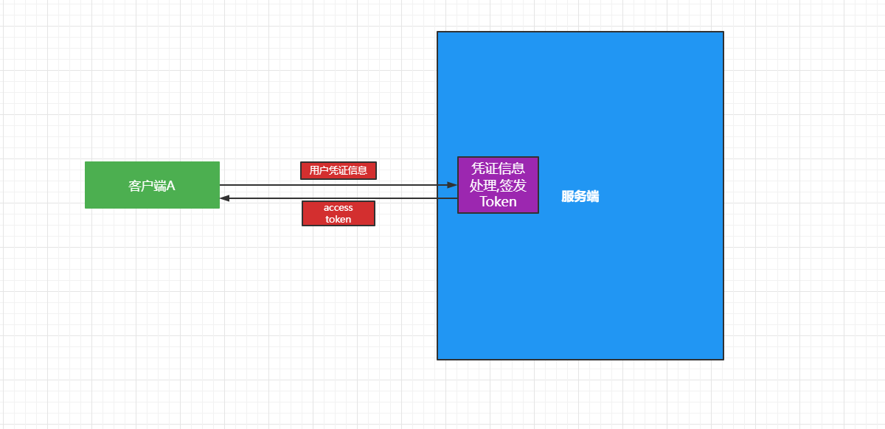
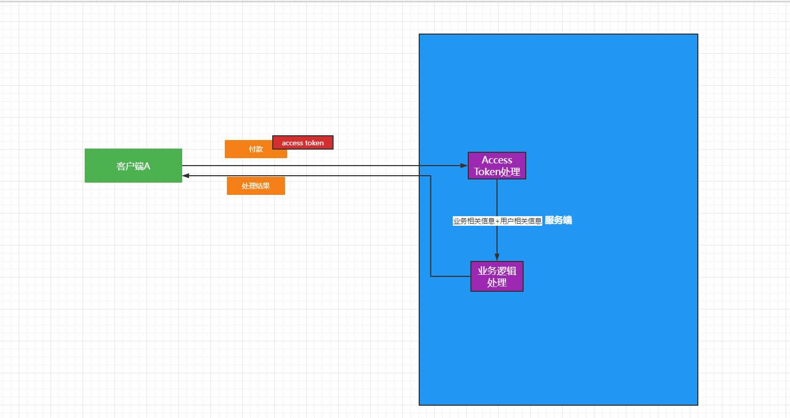
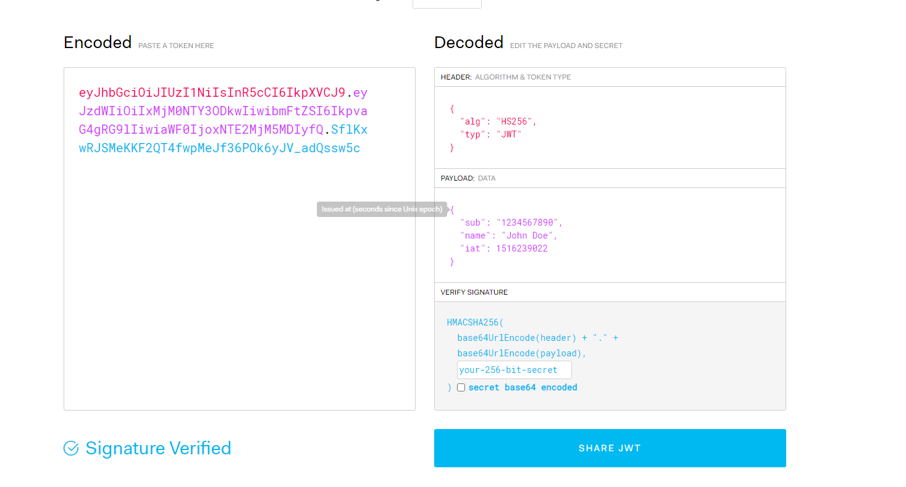
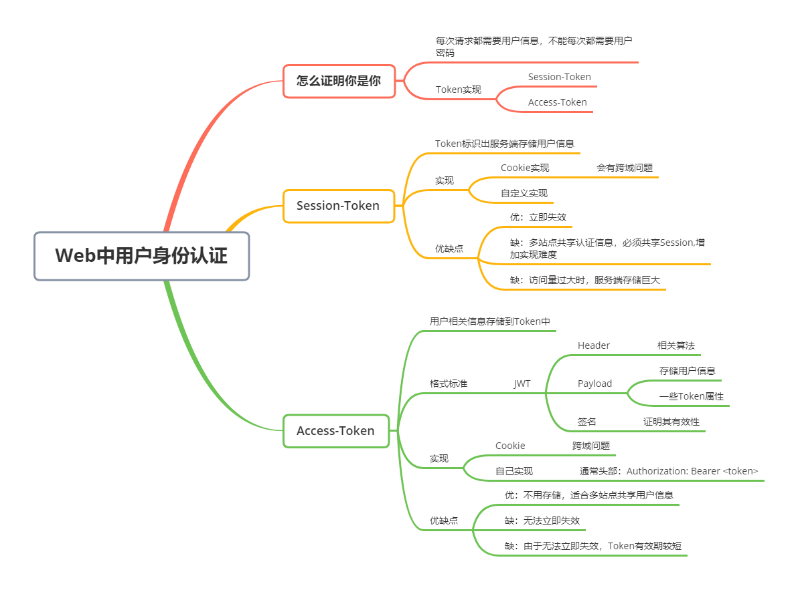

# Web应用中用户身份认证(Session、Access Token/JWT)


## 简介

文本将会讲述，在们web应用和服务端交互的过程中，用户身份认证相关的问题，你将会了解到`Session`方案和`Access Token`(`JWT`)的方案


## 怎么证明你是你？

​			你在网页上浏览着淘宝的网页，一会加一个商品到购物车上。一会儿下一个单。你一次一次的点击,服务器就怎么会知道是你在做这些操作，加商品到购物车时，他怎么就会知道加到你的购物车上呢？这就是设计一个核心问题怎么证明你是你？


我们首先思考几个问题。

+ 我不是登录了嘛，那这不是已经认证过了吗？

  首先来说Web应用与服务端的交互是基于Http的，Http是短连接无状态的协议。也就是你没点击一下就会发一次请求然后获得响应就结束了，每次都是这样的，在协议层面没有任何区别标识出你是原来的发送请求的客户端，所以他是无状态的。

+ 能不能在每次请求的时候把账户密码带上？

  实际理论上可以解决上面的问题，如果每次都得输入的话使用者估计得疯掉。如果存储到客户端应用中，这样就把凭证（账户密码）暴露在外面了，安全吗？还有就是每次都请求都携带凭证，而这些凭证一般都是稳定不变的（没人天天改密码），这样就增加暴漏的风险，是极其不安全的。

+ 那我们怎么解决？

  ​		一般设计身份认证的问题，无论在硬件领域，还是软件领域，我们都会使用Token这一思路来解决问题。**`Token就是一段信息，能让对方识别出你的一些有效信息，来完成身份的认证`。**

  ​		在Web应用中大家使用的Token相关的认证方式，就是从Token中识别的信息不同而已。一般流行的两种解决方法，

  + 第一种就是可以从Token中识别出这是哪一个在进行的会话，然后找到，访问这个会话的相关信息（存储在服务端），有了这些信息，识别出客户端就相当简单了，也就是证明了你是你。有点类似实现了长连接。
  + 第二种就是直接解析验证Token，从Token中可以解析出用户相关的信息，直接识别出这个用户的各种有效权限信息。
  
  上面两种方案的Token都是短期有效的。


## Session ID

​		**`session ID`** 就是我们的第一种解决方案，也称之为 **`session identifier`**、 **`session token`** 。`Session` 这个词比较形象，可以译为会话、一段时间、一场会议。就拿客户端和服务端交互来说，就可以看作他们之间一场会话。比如来说你在一段时间内刷着淘宝，进行一些操作。这段时间你的终端和淘宝的服务端的交互就看做一场会话。

​		现在我们明白了会话相关的概念，我服务端和多个终端进行的交互，会建立一个一个会话，相关的会话信息（终端是谁？有些那些权限）的就会存储在服务端，只要我们能够识别客户端发来的请求是属于哪个会话的我们就会容易验证是谁来访问的，也就是实现了身份认证。所以客户端需要一个session相关的标识让服务端识别，这也就是`SessionID`，客户端怎么获得的呢？需要的凭证信息比如账户和密码，向服务端申请`SessionID`。

​		我们分为一下几个步骤

如下图所示，我们首先要生成Session相关信息，也就是建立会话。



+ 首先客户端发送凭证信息到服务端
+ 服务端根据凭证信息，验证用户身份，生成Session相关信息存储到合适的位置
+ 返回给客户端Session唯一标识可称之为`SessionID`
+ 客户端收到`SessionID`后就会存储到本地


后边连续的请求肯定是要携带这个`SessionID`的，我们后边是怎么处理的呢？




+ 我们发送一个业务相关的请求（比如付款），携带上`SessionID`
+ 服务端收到后会校验这个`SessionID`，然后查询相关的Session信息
+ 这首后根据Session我们拿到用户相关信息后，然后把业务相关信息+用户相关信息发送业务处理的模块（也就是说现在我们知道谁要付款了）
+ 返回响应的业务成立结果（比如付款成功）

这是我们携带的`SessionID`的请求所处理的逻辑操作。


我们可能下面的疑问？

+ 直接用用户ID不行吗？

  首先来说这个ID是一段时间内是有效的，会话结束了或者到期了就无效了。其次是服务端知道是自己是检验凭证信息成功后签发的这个ID。

  `SessionID`无效后登录信息失效客户端得重新申请，一般大家常遇见的操作就是重新登陆。

+ 别人有可能窃取这个ID吗？这样会安全吗？

  会的，如果客户端使用Cookie实现的话，大家都知道怎么存储的，标准是公开的，就是可能遭受到`XSS`和`CSRF`攻击，在浏览器不小心执行恶意脚本从存储Cookie的位置获取`SessionID`还有就是利用获取的`SessionID`伪造请求，这样是不安全的。

+ 有办法抵抗这些攻击吗？

  有，现在做的很不错了，现在浏览器的严格检查，尽量不去执行一些外来的恶意程序，还有防止跨域请求。安全方法的问题留到后面文章


`我们一般怎么实现存储和携带的呢？我们获得的SessionID放在那里的呢？请求的时候放在那里的呢？`

上面这些问题我们统统可以使用Http-Cookie进行解决，Cookie机制现在浏览器中都支持的很好。

举一个简单例子，登陆请求发送之后，服务器在响应的时候在响应头添加下面的数据，浏览器会自动存储Cookie值到本地，浏览器直接就把我们的`SessionID`进行存储。

```tex
Set-Cookie: <cookie-name>=<cookie-value>
```

浏览器再发后面连续的请求的时候每次都会在携带。

```tex
GET /eee_page.html HTTP/2.0
Host: www.eee.org
Cookie: eee_cookie=choco;
```

因为格式规则都是公开的都很容易遭受攻击比如XSS攻击。

Cookie具体使用细节在后面文章进行讲解。

服务端怎么实现的呢？

服务端就很好实现，现在框架都支持的很好。查询相关框架对Session的支持就好，都有对应的解决方案。

`Cookie禁止怎么办？`

这就是让我们自己的前端自己实现存储的位置，还有发送的格式。

发送格式一般就是使用其他的头部字段 比如`SessionID`,或者每次都放到URL中，只要能让服务端获取到就行。

多站点共享登录信息或者微服务怎么办？

把Session存储的变为共享的，之前一般就是存储在服务器的内存中，现在我们可以从出到外部，比如Redis或者其他的数据库中


##  Access Token

我们暂且认为这种叫做 `Access Token`，我们先来定义一下这种Token。

Access Token 是一段信息，包含着用户的信息、权限、时间限制。它是由服务端生成发送给客户终端的。[^1]

​		确定好定义后，我们会惊讶的发现Token包含着我们对客户端的权限用户等相关的信息，这就是说，服务端就不用会对客户端做一会话的信息进行存储了，只要解析Token就可以完成对客户端的认证，证明了你是你的问题。从某种角度说又变回无状态的，好处是显而易见的，服务端更专注与业务功能实现，不用考虑相关的当前存储会话相关信息。（感觉思想有点像，函数式编程中依赖外部数据函数向纯函数的转变）。

​		这种形式当然好，但是我们怎么解决Token的可信问题，如果别人可以伪造一个Token，这一切不就没有意义了吗？

其实服务端在签发Token的时候，会附着一个码值，这个码值来验证这个Token是不是服务端本身签发的，可以把码值称之为签名。`因为签发端和验证端都在服务端`，所以这种签名的能够实现的算法比较多，比如Mac算法，对称加密算法，非对称加密算法都可以实现签名校验Token的合法性，大家一般使用[`Hmac`](https://blog.csdn.net/tianpengfei123/article/details/123947217)算法。

​		现在我们简单的描述一下步骤




+ 客户端向服务端发送凭证信息，

+ 客户端认证授权服务会处理凭证信息，生成一个Token（包含使用特定算法的签名）返回给客户端


我们利用图示看一下后面后续的访问请求中怎么实现认证的



+ 发送相互相关请求，并携带access token
+ 服务端收到后利用相关的签名算法校验Token的合法性，通过后提取相关的用户信息
+ 把信息传递给业务相关的处理功能服务
+ 业务处理完成后返回结果

发没发现服务端没有存储任何会话会话相关的状态，更加专注于的业务处理。


现在Access Token的格式规范，最受欢迎的就是`JWT(JSON Web Token)`，我们来看一下它的规范是怎么样的？

它是由两个json串和一个签名值组成

结构

分为三部分：`HEADER`  `PAYLOAD` `VERIFY SIGNATURE`




`HEADER` 头部为一个JSON,其中 `alg`表示签名算法，`typ`表示固定值表示JWT规范

`PAYLOAD` 有效载荷为一个JSON，这里放一些用户信息，用户权限，过期时间等等表示身份的常用信息。使用者可以放置一些自定义的字段信息

`VERIFY SIGNATURE`签名值：因为我们签名算法为HS256(HMACSHA256的简写),所以计算过程为 `HMACSHA256(base64UrlEncode(header)+"."+base64UrlEncode(payload),secret)`。Base64Url算法和Base64算法略有不同 。


在传输的过程这个Token是要被编码的，编码算式如下


```java
const token = base64urlEncoding(header) + '.' + base64urlEncoding(payload) + '.' + base64urlEncoding(signature)
```


怎么实现存储和携带的呢？

同样使用Cookie可以实现，但是这样也同样会因为使用Cookie，会带来攻击和跨域的问题。但是大家不这么实现，会自己实现存储不依赖Cookie。Token的携带也是放到请求头下面字段中

```tex
Authorization: Bearer <token>
```

服务端有一个认证服务对Token进行解析，产生对应的信息转发到相应的服务上。


## 优缺点

优缺点就很明显了

### **立即失效方面**

`SessionID`的话，由于自己存储很方便实现Token失效，如果用户`登出`，直接删除对用的Session信息就可以了

`AccessToken`的话，就无法使其Token立即失效，得在服务端存储一些东西才能完成立即失效的功能，比如每个用户使用不用的Key验证签名，立即失效更改签名就行。但是这样就丧失了无状态性。


### 存储方面

Access Token不考虑立即失效不考虑存储。

`SessionID`方式必须每一个会话都要存储，直到失效。对于访问量较高的系统，这样就有可能造成成千上万的Session信息存在。而且如果涉及到多站点共享认证功能就得考虑共享Session存储了。


### 实现方面

`SeesionID`在如果是多站点的话，存储方面需要些难度


根据自己实际情况选择哪一种认证方案，没有绝对好的。还有一点因为Access Token无法立即失效，Token的有效期要尽可能短。

## 总结


总而言之，言而总之。我们解决的是在一段时间内对网站的访问，我们登录一次，接下来的操作我们就不需要的登录，服务端就知道你是你的问题？

​		我们使用Token进行解决。两种Token的解决方式。一种是服务端根据登录提交的信息，生成你的个人会话相关信息主要是包含你的一些个人信息，下发一个Token来标识生成的这个会话信息，客户端每次携带Token访问，服务端根据Token可以找到相关的会话信息。 第二种就是，服务端根据用户登录提交的信息，生成的Token直接包含了用户的一些信息，Token的签发需要服务端进行签名来保证有效性，客户端每次请求时进行访问。

​		其实就是一个是把有效信息存储到服务端，一个是把有效信息存储到客户端。

应为Cookie的标准都是公开的，使用Cookie进行实现有可能遭到XSS攻击和CSRF攻击，解决方法自己实现，攻击者无法知道你是怎么实现存储的，自然也就知道不到Token。

很多情况大家只把第二种方法叫做Token实现，第一种叫做Session实现，只是定义问题，大家懂得其中原理就好。

Cookie只是一种存储和发送的机制，是为了解决Http的无状态性，第一种方案和第二种方案都可以使用Cookie进行实现。但是会引来一些问题（那些攻击）。





## 引用

[^1]: [Access Token ](https://www.okta.com/identity-101/access-token/) "An access token is a tiny piece of code that contains a large amount of data. Information about the user, permissions, groups, and timeframes is embedded within one token that passes from a server to a user's device."