# 快速入门单元测试-Junit5

## 简介

本文可以让你快速了解Junit5一些特性，迅速掌握Junit5的一些概念。有些地方大家清楚特性就行，当我们使用到的时候，再去通过官网探究功能接口的详细使用尤其是`其他`章节的部分。


## 测试的结构


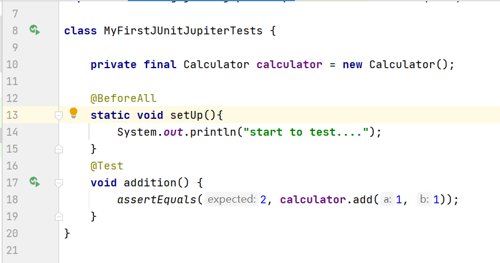

​		从这个测试案例我们开始介绍，看上图的测试里面我们可以介绍几个相关的概念。

+ `@Test`注解表示这个方法是一个测试方法。使用IDE的支持，可以直接点击小图标直接运行测试。值得一提的是，现在大部分的IDE和构建工具都对Junit5进行了支持。 `@BeforeAll`就是本测试类的测试方法运行之前进行运行，一般用于测试环境的准备
+ 测试方法和所在的测试类不能是私有，其他的都可以。
+ 断言：判断执行结果是否正确，比如：`assertEquals`

通过上面的案例我们来做几个定义

**`Lifecycle Method`**： 生命周期方法 一般用于测试用例前或者后执行的方法，比如`@BeforeAll`, `@AfterAll`, `@BeforeEach`, or `@AfterEach`.上面的`setUp`就是一个`Lifecycle Method`。

**`Test Class`**：包含测试方法的类，可以是顶层类、静态成员类、或者Nested类。这些类不能是抽象且必须有构造方法。上面的`MyFirstJUnitJupiterTests`就是一个`Test Class`

**`Test Method`**：可以当作测试案例执行的方法。上面的方法`addition`就是一个 `Test Method`


## Lifecycle Method

对测试的环境的准备必不可少，Junit提供了四个注解修饰方法，让我们使用来对我们测试进行准备。 


**`@BeforeEach`**

> 表示该方法在当前测试类（Test Class）的**每个**测试方法（Test Method）运行之前执行一遍，必须是非静态方法


**`@AfterEach`**

> 表示该方法在当前测试类（Test Class）的**每个**测试方法（Test Method）运行完成之后执行一遍，必须是非静态方法。


 **`@BeforeAll`**

> 表示的是该方法应当在当前测试类（Test Class）中所有测试方法（Test Method）之前执行，默认情况下该方法必须是静态（static）的。


**`@AfterAll`**

> 表示的是该方法应当在当前测试类（Test Class）中所有测试方法（Test Method）执行完成之后执行，默认情况下该方法必须是静态（static）的。


用一个案例进行说明


```java
class LifecycleMethodTests {


    @BeforeAll
    static void initAll() {
        println("init all test...");
    }

    @BeforeEach
    void init() {
        println("init each test...");
    }

    @Test
    void test_1() {
        println("execute test 1");
    }
    @Test
    void test_2() {
        println("execute test 2");
    }

    @AfterEach
    void tearDown() {
        println("tear down each test...");
    }

    @AfterAll
    static void tearDownAll() {
        println("tear down all test...");
    }


    static void println(String message){
        System.out.println(message);
    }
}
```

执行结果为：

```tex
init all test...
init each test...
execute test 1
tear down each test...
init each test...
execute test 2
tear down each test...
tear down all test...
```


##  <a id="testInstance">测试时的实例</a>

有没有想过， `@BeforeAll`和`AftereAll`修饰的方法为什么是静态的？

Junit5考虑到测试方法之间独立性和避免人为的修改状态对测试造成副作用。Junit为每一个测试方法创建一个测试类的实例。

```java
public class TestInstanceDemo {
    private final Calculator calculator = new Calculator();

    @BeforeAll
    static void  setUp(){
        System.out.println("start to test....");
    }

    @Test
    void addition() {
        System.out.println(this);
        assertEquals(2, calculator.add(1, 1));
    }

    @Test
    void division () {
        System.out.println(this);
        assertEquals(2, calculator.divide(4, 2));
    }
}
```

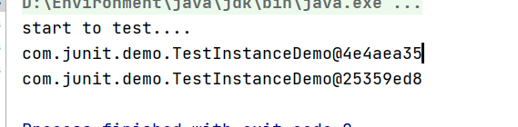


 `@BeforeAll`和`AftereAll` 的目的测试方法共享一些什么，不同实例共享的话，就只能是类的状态了，只能是静态方法了。

我们可以通过`@TestInstance`注解，来让测试方法在统一实例下进行测试。---->`@TestInstance(TestInstance.Lifecycle.PER_CLASS)`

`TestInstance.Lifecycle.PER_CLASS`表示用一个此类的实例测试下面的测试方法,这时`@BeforeAll`和`AftereAll`就可以修饰非静态的方法了。

`TestInstance.Lifecycle.PER_METHOD`表示每一测试方法都有一个不同的当前测试类的实例（默认情况）。


```java
@TestInstance(TestInstance.Lifecycle.PER_CLASS)
public class TestInstanceDemo {
    private final Calculator calculator = new Calculator();

    @BeforeAll
    void  setUp(){
        System.out.println("start to test....");
    }

    @Test
    void addition() {
        System.out.println(this);
        assertEquals(2, calculator.add(1, 1));
    }

    @Test
    void division () {
        System.out.println(this);
        assertEquals(2, calculator.divide(4, 2));
    }
}
```

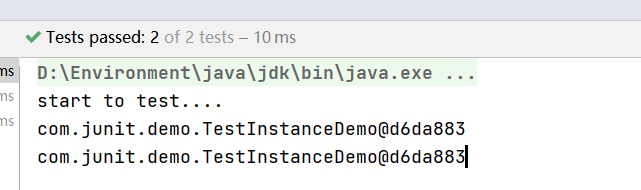


如果默认情况下使用非静态的就会报错

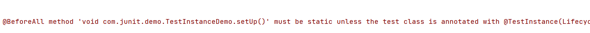

## Test Method

测试方法，用于测试某个接口，直接可以运行的方法。

最简单最常用的是‘

### Test

@Test修饰的方法为测试方法

示例：

```java
	@Test
    void addition() {
        assertEquals(2, calculator.add(1, 1));
    }
```


### Repeated Test

@RepeatedTest修饰的方法为测试方法。

这个是为了指定测试方法的执行次数。每一次执行效果就和@Test作用一样

```java
public class RepeatedTestsSimpleDemo {
    @BeforeEach
    void beforeEach() {
        System.out.println("init each test...");
    }

    @RepeatedTest(3)
    void repeatedTest() {
        System.out.println("test...");
    }

    @AfterEach
    void tearDown() {
        System.out.println("tear down each test...");
    }

}
```

执行结果：

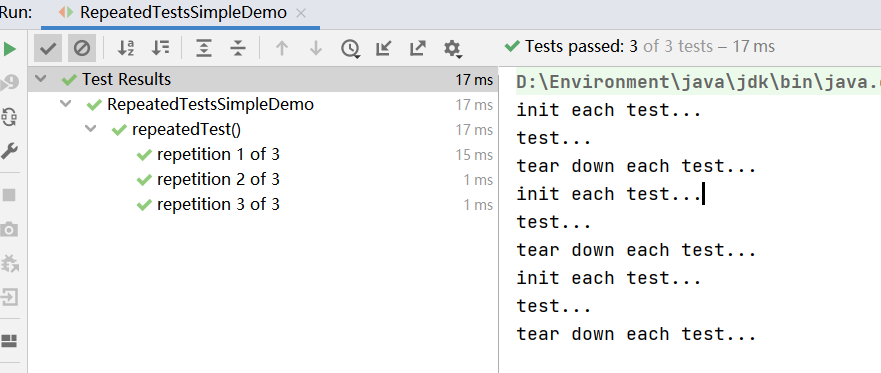

[更多](https://junit.org/junit5/docs/current/user-guide/#writing-tests-repeated-tests)


### Parameterized Test

@ParameterizedTest修饰的方法为测试方法。

此注解可以让我们的测试方法执行多次，但是可以使用不同的参数。必须配合`@ValueSource`注解。

```java
public class ParameterizedTestDemo {

    @BeforeEach
    void beforeEach() {
        System.out.println("init each test...");
    }

    @ParameterizedTest
    @ValueSource(strings = { "racecar", "radar", "able was I ere I saw elba" })
    void palindromes(String candidate) {
        System.out.println("test...");
        assertTrue(StringUtils.isNotBlank(candidate));
    }

    @AfterEach
    void tearDown() {
        System.out.println("tear down each test...");
    }


}
```

执行结果：

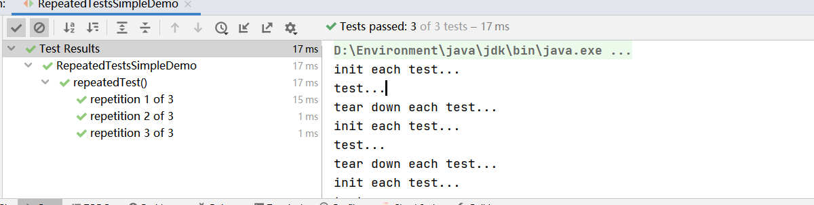

更灵活详细的用法，请参考官方文档。

[更多](https://junit.org/junit5/docs/current/user-guide/#writing-tests-parameterized-tests)

### Dynamic Test

我们的上面测试，在编译完成之后就是已经是固定的了。现在我们需要在运行时候，生成我们的测试。

​		这时候我们使用**@TestFactory**注解，方法返回一个`DynamicNode`或者是它的`Stream`、`Collection`、`Iterable`,、`Iterator`，运行此方法就会生成我们一个个的测试并且执行。有点像生成测试的工厂，所以注解名字是`TestFactory`

举例：

```java
	@TestFactory
    Stream<DynamicTest> dynamicTestsFromIntStream() {
        // Generates tests for the first 10 even integers.
        return IntStream.iterate(0, n -> n + 2).limit(10)
                .mapToObj(n -> dynamicTest("test" + n, () -> assertTrue(n % 2 == 0)));
    }
```

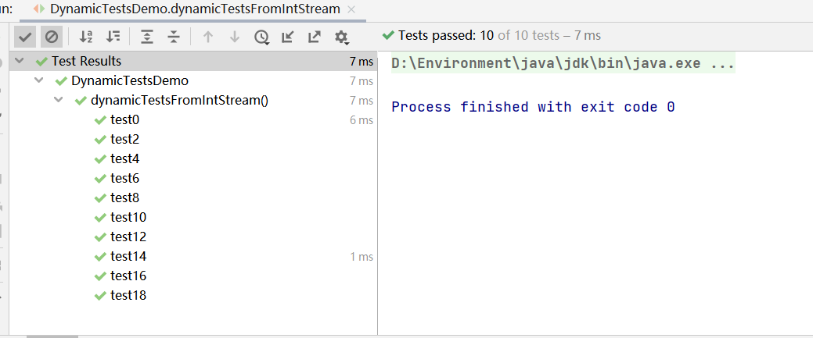

测试是我们运行时动态生成的。

[更多](https://junit.org/junit5/docs/current/user-guide/#writing-tests-dynamic-tests)

### TestTemplate

不常用，略

[更多](https://junit.org/junit5/docs/current/user-guide/#writing-tests-test-templates)

## Nested Tests

为了更好描述测试之间的关系，比如有时候我们的测试的条件状态递进的，可以想象成一个状态树，每一个节点都有自己的测试状态。这样我们可以利用`@Nested`注解和java的`NestClass`,来更好描述描述测试层次结构。

```java
import static org.junit.jupiter.api.Assertions.assertEquals;
import static org.junit.jupiter.api.Assertions.assertFalse;
import static org.junit.jupiter.api.Assertions.assertThrows;
import static org.junit.jupiter.api.Assertions.assertTrue;

import java.util.EmptyStackException;
import java.util.Stack;

import org.junit.jupiter.api.BeforeEach;
import org.junit.jupiter.api.DisplayName;
import org.junit.jupiter.api.Nested;
import org.junit.jupiter.api.Test;

@DisplayName("A stack")
class TestingAStackDemo {

    Stack<Object> stack;

    @Test
    @DisplayName("is instantiated with new Stack()")
    void isInstantiatedWithNew() {
        new Stack<>();
    }

    @Nested
    @DisplayName("when new")
    class WhenNew {

        @BeforeEach
        void createNewStack() {
            stack = new Stack<>();
        }

        @Test
        @DisplayName("is empty")
        void isEmpty() {
            assertTrue(stack.isEmpty());
        }

        @Test
        @DisplayName("throws EmptyStackException when popped")
        void throwsExceptionWhenPopped() {
            assertThrows(EmptyStackException.class, stack::pop);
        }

        @Test
        @DisplayName("throws EmptyStackException when peeked")
        void throwsExceptionWhenPeeked() {
            assertThrows(EmptyStackException.class, stack::peek);
        }

        @Nested
        @DisplayName("after pushing an element")
        class AfterPushing {

            String anElement = "an element";

            @BeforeEach
            void pushAnElement() {
                stack.push(anElement);
            }

            @Test
            @DisplayName("it is no longer empty")
            void isNotEmpty() {
                assertFalse(stack.isEmpty());
            }

            @Test
            @DisplayName("returns the element when popped and is empty")
            void returnElementWhenPopped() {
                assertEquals(anElement, stack.pop());
                assertTrue(stack.isEmpty());
            }

            @Test
            @DisplayName("returns the element when peeked but remains not empty")
            void returnElementWhenPeeked() {
                assertEquals(anElement, stack.peek());
                assertFalse(stack.isEmpty());
            }
        }
    }
}
```

@Nested修饰的类必须是非静态的内部类。默认上层的且同一条路线上的`@BeforeEach` and `@AfterEach`修饰的方法有效于下层的测试。默认情况下@Nested无中的@BeforeAll和@AfterAll无效，这是java本身的限制（java16之前不能在内部类里面有静态成员）。可使用`@TestInstance(Lifecycle.PER_CLASS)`进行避免，原理看[测试时的对象](#testInstance)

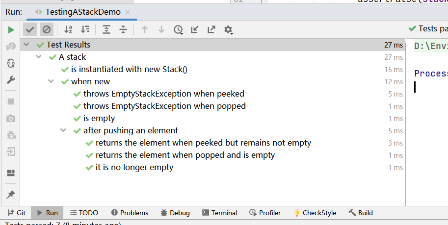

类的层次结构：


这里面的类都是测试类（`Test Class`）。

[更多](https://junit.org/junit5/docs/current/user-guide/#writing-tests-nested)

## 断言


断言之前我们描述过，就是判断我们的测试的执行结果是否正确

### 基本使用

Junit5本身提供了断言，来让我们进行判断测试结果是否正确。


`assertEquals` 判断相等，如果不相等则失败。

```java
assertEquals(2, calculator.add(1, 1));
```

`assertTrue`：判断结果为`True`，如果不为True则失败。

```java
assertTrue('a' < 'b')
```

`assertNotNull`：判断结果不为空，如果为空则失败。

```java
assertNotNull(firstName);
```

`assertTimeout`：判断超时，如果超时，则失败。

```java
assertTimeout(ofMinutes(2), () -> {
            // Perform task that takes less than 2 minutes.
        });
```

分组断言，就是把几个断言放在一个分组中

```java
assertAll("person",
                () -> assertEquals("Jane", person.getFirstName(),"12"),
                () -> assertEquals("Doe", person.getLastName(),"12")
        );
```


如果失败了，设置失败的描述信息：

```java
assertEquals(5, calculator.multiply(2, 2),
                "The optional failure message is now the last parameter");
```

```tex
org.opentest4j.AssertionFailedError: The optional failure message is now the last parameter ==> 
Expected :5
Actual   :4
```


在某些测试情况，我们功能模块是要抛出异常的，这也是功能的一部分，所以我们也需要对异常进行测试

```java
void exceptionTesting() {
        Exception exception = assertThrows(ArithmeticException.class, () ->
                calculator.divide(1, 0));
        assertEquals("/ by zero", exception.getMessage());
}
```

### 三方库的断言

Junit的断言，有时候会让我们混淆哪里是期望值，那里是实际结果，比如`assertEquals(2, calculator.add(1, 1));`我们就比较容易混淆哪里放期望值哪里放实际结果值。

还有就是匹配条件不够灵活且描述性也不高。

所以我们可以使用第三方来进行补充，我们来看一个`harmast`来提供的断言，匹配条件。

```java
 @Test
    void assertWithHamcrestMatcher() {
        assertThat(calculator.subtract(4, 1), is(equalTo(3)));
    }
```

我们就一眼看出，第一个参数是实际执行的结果，第二个参数就是对匹配条件的描述，可以看出第二参数描述性很强。


### Void方法怎么测试

Void方法测试，我们可以使用`Mockito`框架，这是一个模拟依赖对象的框架，比如A模型依赖B模型,对A进行测试的时候，我们由于某些原因难以构建B模型，我们可以使用Mockito进行模拟一个B模型，来对A功能接口进行测试。

我们可以通过对模拟对象的一些接口的调用判断来测试我们的无返回值的接口。

实例：

```java
@Test
void testAddItem(){
    B b = mock(B.class);
    A a = new A(b);
    service.doSomthing(parameter);
    verify(b).doSomething(any());
}
```

`这样就可以测试到我们的功能实现了，但这也测试到了实现细节。测试到实现细节，有一个后果就是实现世界是不问稳定，同这样的功能今天这么么实现，明天那么实现，这就导致我们测试也得跟着改变。所以尽量少用verify。`


[更多](https://junit.org/junit5/docs/current/user-guide/#writing-tests-assertions)

## 其他


### 更好的描述

junit5 给我提供一个注解，来让我们更好的描述我们的测试类的测试方法，默认使用的是测试方法名称或者测试类的名称

**`@DisplayName`**

```java
@DisplayName("A special test case")
class DisplayNameDemo {

    @Test
    @DisplayName("Custom test name containing spaces")
    void testWithDisplayNameContainingSpaces() {
    }

    @Test
    @DisplayName("╯°□°）╯")
    void testWithDisplayNameContainingSpecialCharacters() {
    }

    @Test
    @DisplayName("😱")
    void testWithDisplayNameContainingEmoji() {
    }

    @Test
    void testDefault(){
    }
    
}
```

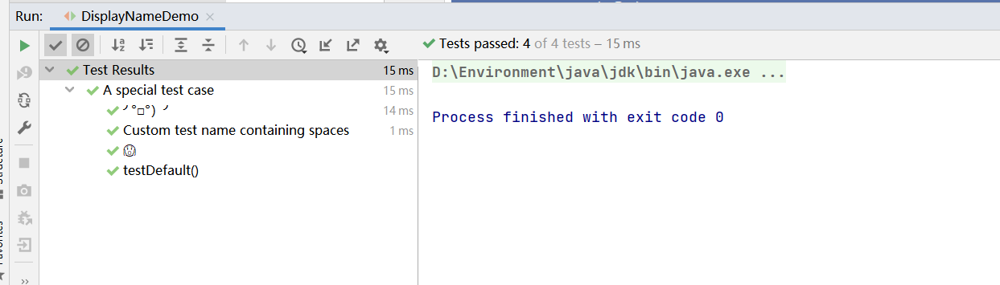


还有很多有意思的使用方式，比如使用的是`DisplayNameGenerator`, 可以自定义使用什么方式生成测试的描述。比如 把测试类或者测试方法的名称中下划线替换成空格来当作测试的描述

```java
@DisplayNameGeneration(DisplayNameGenerator.ReplaceUnderscores.class)
 class A_year_is_not_supported {
	@Test
    void if_it_is_zero() {
      }
 }
```


[更多](https://junit.org/junit5/docs/current/user-guide/#writing-tests-display-names)

### 组合注解（Composed Annotations）

Junit提供的注解都是元注解（`Meta-Annotations`），我们可以使用这些元注解组合自己的注解形成组合注解。组合注解的语义继承这些元注解。

组合注解可以提高效率和可读性

比如我们不使用组合注解写法如下：

```java
@Target({ ElementType.TYPE, ElementType.METHOD })
@Retention(RetentionPolicy.RUNTIME)
@Tag("fast")
public @interface Fast {
}
```

```java
@Fast
@Test
void myFastTest() {
    // ...
}
```

使用之后

```java
@Target(ElementType.METHOD)
@Retention(RetentionPolicy.RUNTIME)
@Tag("fast")
@Test
public @interface FastTest {
}
```

```java
@FastTest
void myFastTest() {
    // ...
}
```

上面是一样的效果。


### 不测试、某种条件下测试

**不测试，**

由于某些原因不进行测试，使用@Disable

```java
@Disabled("Disabled until bug #99 has been fixed")
class DisabledClassDemo {

    @Test
    void testWillBeSkipped() {
    }

}
```

```java
class DisabledTestsDemo {

    @Disabled("Disabled until bug #42 has been resolved")
    @Test
    void testWillBeSkipped() {
    }

    @Test
    void testWillBeExecuted() {
    }

}
```

[更多](https://junit.org/junit5/docs/current/user-guide/#writing-tests-disabling)

某种条件下进行测试

这种条件可以是操作系统`@EnabledOnOs`、可以是java运行时环境`EnabledOnJre`、还可以是某个系统属性`@EnabledIfSystemProperty`，当然也可以自定义

```java
@Test
@EnabledOnOs(MAC)
void onlyOnMacOs() {
    // ...
}

@TestOnMac
void testOnMac() {
    // ...
}

@Test
@EnabledOnOs({ LINUX, MAC })
void onLinuxOrMac() {
    // ...
}

@Test
@DisabledOnOs(WINDOWS)
void notOnWindows() {
    // ...
}

@Target(ElementType.METHOD)
@Retention(RetentionPolicy.RUNTIME)
@Test
@EnabledOnOs(MAC)
@interface TestOnMac {
}
```

[更多](https://junit.org/junit5/docs/current/user-guide/#writing-tests-conditional-execution)


### 测试的执行顺序

测试之间是相互独立的，所以测试的顺序不影响结果，但是测试顺序有时候也相当重要，尤其是集成测试的时候，比如对性能的影响等。Junit支持测试顺序的设置。相关注解`@Order` `@TestClassOrder`

[更多](https://junit.org/junit5/docs/current/user-guide/#writing-tests-test-execution-order)


### 设置超时时间

**@Timeout(**5**) ** 可以添加到`Lifecle Method` 和`Test Method`上，执行的过程中，超时就报异常

[更多](https://junit.org/junit5/docs/current/user-guide/#writing-tests-declarative-timeouts)

### 扩展（Extension）

如果Junit提供的接口，大部分都是注解，不能很好进行测试。我们可以自己通过扩展来实现自己想要的功能,例如Spring提供的`SpringExtension`,

使用方式`@ExtendWith(CertainExtension.class)`，Junit也提供了一些内置扩展

[内置扩展](https://junit.org/junit5/docs/current/user-guide/#writing-tests-built-in-extensions)

[扩展模型](https://junit.org/junit5/docs/current/user-guide/#extensions)


### 测试中使用接口和默认方法

`@Test`, `@RepeatedTest`, `@ParameterizedTest`, `@TestFactory`, `@TestTemplate`, `@BeforeEach`, and `@AfterEach`都可以修饰inteface中的default方法。

继承接口的类，也会把这些继承过去。

以打印测试日志场景举例

```java
interface TestLifecycleLogger {

    Logger logger = Logger.getLogger(TestLifecycleLogger.class.getName());

    @BeforeAll
     static void beforeAllTests() {
        logger.info("Before all tests");
    }

    @AfterAll
    static void afterAllTests() {
        logger.info("After all tests");
    }

    @BeforeEach
    default void beforeEachTest(TestInfo testInfo) {
        logger.info(() -> String.format("About to execute [%s]",
                testInfo.getDisplayName()));
    }

    @AfterEach
    default void afterEachTest(TestInfo testInfo) {
        logger.info(() -> String.format("Finished executing [%s]",
                testInfo.getDisplayName()));
    }

}
```

```te
public class TestLifecycleLoggerImplDemo implements TestLifecycleLogger{

    @RepeatedTest(10)
    void repeatedTest() {
        System.out.println("test...");
    }
}
```

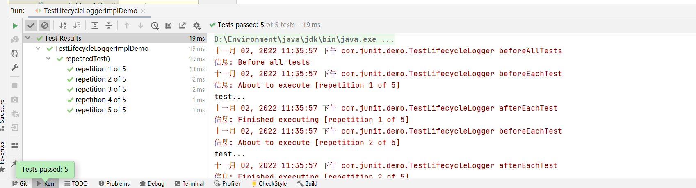


还有一种情况，就是为某个接口的**锲约**写测试，比如`Object.equals` or `Comparable.compareTo`。遵守一定的规则，来测试他们到底遵守没有遵守。可在接口使用测试

[更多](https://junit.org/junit5/docs/current/user-guide/#writing-tests-test-interfaces-and-default-methods)


## 总结


测试的结构里面有，`Test Class` `Test Method` 、`Lifecycle Method`、`断言`。

`Test Class`是我们测试所在的类，其中@Nested修饰的class会让测试更有表达性和层次，

`Test Method`是我们要运行的测试的方法，其中包含一些可多次执行的测试方法，执行可指定测试案例的测试方法

`Lifecycle Method`是我们在测试前后执行的方法，主要用于一些环境的准备和资源的释放

断言是判断测试执行是否正确，我们也可以使用第三方库的断言让判断更有表达性。

我们思考分析了为什么@BeforeAll和@AfterAll默认情况只能修饰静态方法，这和测试时生成的测试用例有关。Junit还有一些其他的特性,其中扩展让我们在测试中根据特定的场景使用一些外部的扩展功能，更加灵活。

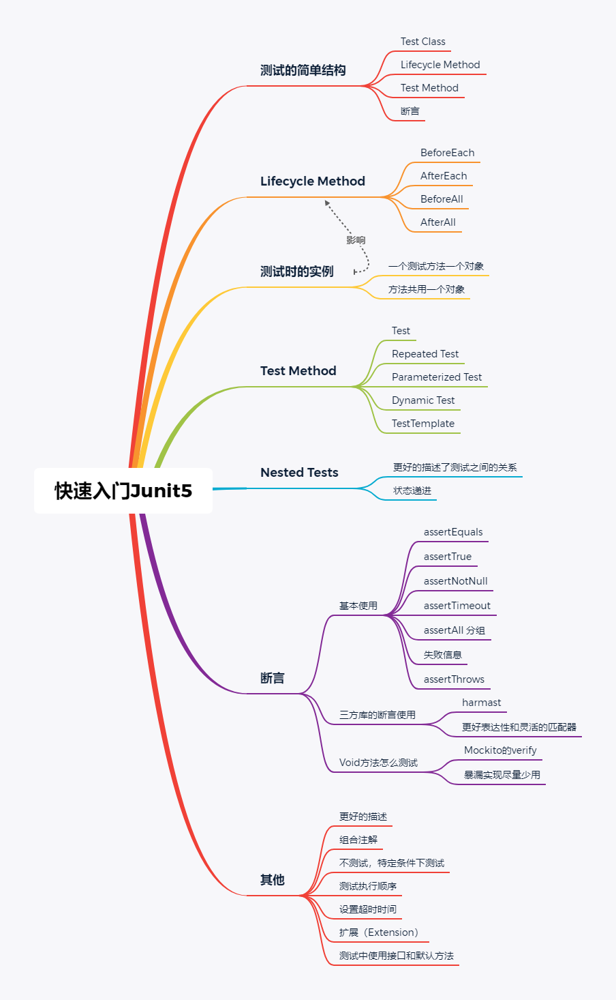


## 参考

[JUnit 5 User Guide](https://junit.org/junit5/docs/current/user-guide/)

