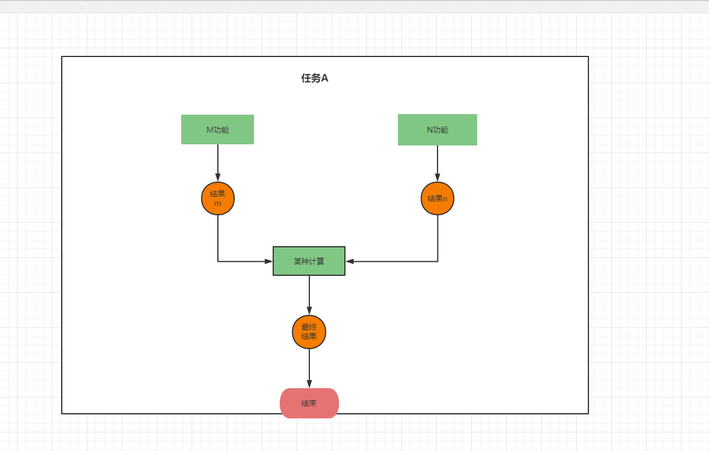
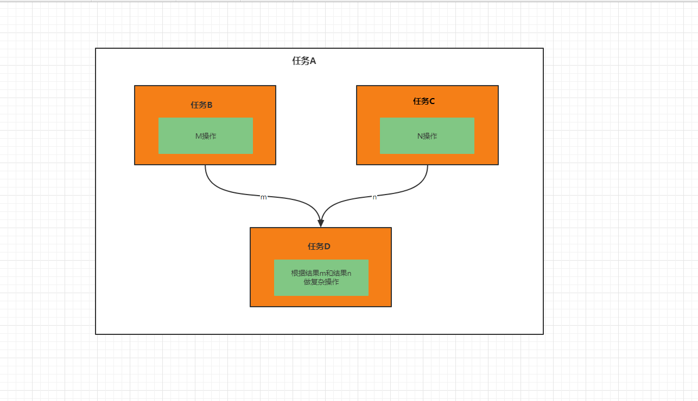
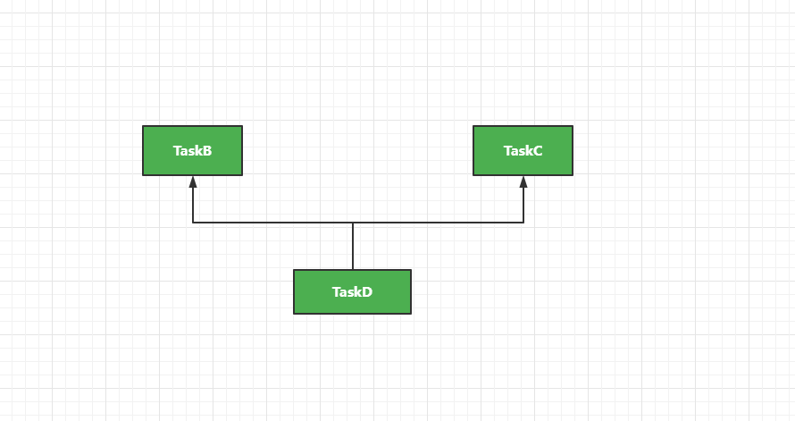
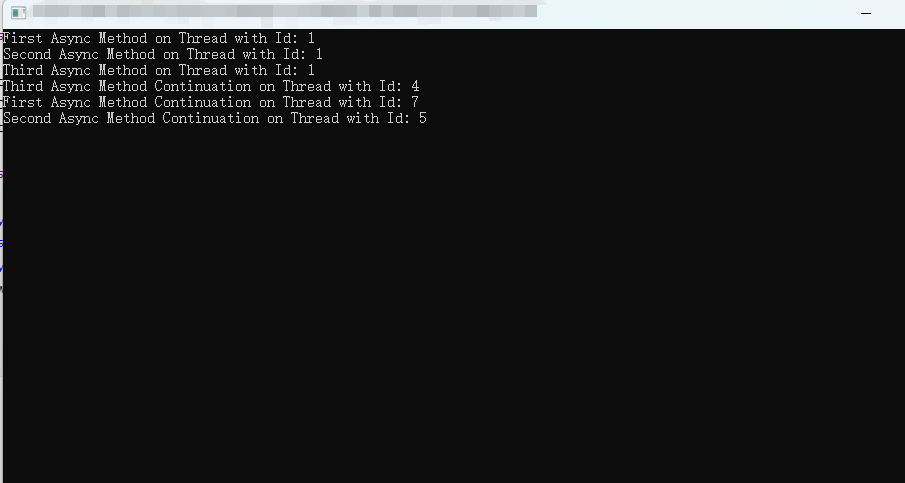
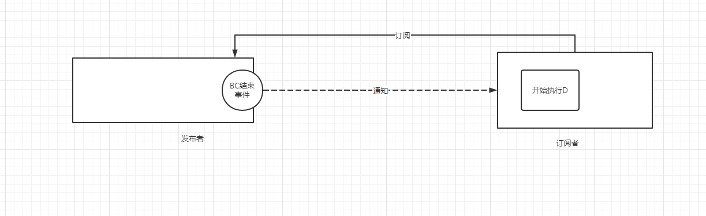
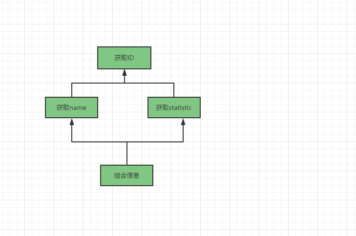

# 响应式编程的来龙去脉（同步编程、多线程编程、异步编程再到响应式编程）


[TOC]

## 简介

本文将会讲述，响应式编程来龙去脉。我们从同步编程讲起，到多线程编程出现，再到为了解决阻塞线程导致浪费资源而出现的异步编程。最后为了更好编写异步的程序出现了的响应式编程。

## 示例

我们通过实际编程例子的方式进行这几种编程方式的探索。我们看一下面例子。

我们要执行一个任务A，任务A具体任务是调用M功能得出一个计算结果，和调用N功能得出一个计算结果。再把两个计算结果进行某种方式的计算得出最终的结果

M功能和N功能需要一定的时间（M、N有阻塞的IO操作）。



我们现在以不同的编程模式进行编程，大家要体会不同的模式的特点。


## 同步编程

我们以单线程，顺序执行的模式进行编程。

我们就顺序进行编码，通过功能M计算出结果m，通过功能N计算出结果n，我们看一下代码。


//模拟M操作和N操作分别好事1000ms

```java
public static int functionM()  {
        try {
            // calculate m...
            Thread.sleep(1000);
        } catch (InterruptedException e) {
            e.printStackTrace();
        }
        return 1;
}

public static int functionN(){
        try {
            // calculate n...
            Thread.sleep(1000);
        } catch (InterruptedException e) {
            e.printStackTrace();
        }
        return 2;
    }
```

我们主线程执行操作如下

```
  public static void main(String[] args) throws InterruptedException {
        long start = System.currentTimeMillis();
        int m = functionM();
        int n = functionN();
        //Complex calculations
        Thread.sleep(1000);
        System.out.println("计算结果："+(m+n));


        System.out.println("耗时："+(System.currentTimeMillis()-start));

    }
```

结果

```tex
计算结果：3
耗时：3036
```


这就是我们单线程顺序执行的结果耗时3s左右


## 多线程编程

首先我们的CPU可以并行执行一些操作，我们在来分析我们的任务，我们任务A中执行M操作和执行N操作很明显可以同时执行。我们现在对我们任务进行分解。





很明显通过上图，我们可以把任务A分解为B、C、D。

首先来说B、C任务是相互不依赖可以同步执行，所以我们给任务B、C分别分配一个子线程去执行。主线程线程使用任务B、C的执行结果执行任务D。


我们通过java的线程池和Future进行实现代码如下：

```java
public class MultithreadingDemo {

    public static void main(String[] args) throws InterruptedException, ExecutionException {
        long start = System.currentTimeMillis();

        ExecutorService threadpool = Executors.newCachedThreadPool();
        Future<Integer> FutureTaskB = threadpool.submit(MultithreadingDemo::TaskB);
        Future<Integer> FutureTaskC = threadpool.submit(MultithreadingDemo::TaskC);

        int m = FutureTaskB.get();
        int n = FutureTaskC.get();

        int result = TaskD(m, n);
        System.out.println("计算结果：" + result);
        System.out.println("耗时：" + (System.currentTimeMillis() - start));
        threadpool.shutdown();
    }

    public static int TaskB() {
        return functionM();
    }

    public static int TaskC() {
        return functionN();
    }

    public static int TaskD(int m, int n) throws InterruptedException {
        Thread.sleep(1000);
        return m + n;
    }

}
```

```tex
计算结果：3
耗时：2078
```


**我们把任务分解，找出可以并行执行的部分，使用多线程进行执行可以并行的部分，这就是多线程编程。**


## 异步编程

**异步编程和多线程编程不是一个角度的概念**

我们来分析一下上面的代码，首先来说主线程衍生出两个子线程，执行任务B和任务C，但是主线程一直在阻塞着，浪费了CPU和线程的一些资源（在流量很高的情况线程是一种很重要的资源，无限制生成新的线程，会爆内存）。如果别的地方需要让他去执行别的操作，很明显我们可以让主线程先去做一些其他的操作。当B和C任务分别在子线程执行完成后。我们可以调度新的线程来执行后续的操作。


**我们先把发起子线程执行任务B和发起子线程执行任务C看成一个任务。这个任务有什么特点呢，我们的主线程发出执行任务指令后，便返回等待结果（阻塞），等待这些操作完成之后，我们在利用这些操作的结果在进行下一步计算。这样的任务操作在我们编程很常见，比如IO操作、其他线程并行执行一些子任务（本例）。这时候我们明显可以把本线程去执行其他的任务等。这就需要这些前置任务完成之后就通知我们，我们就派遣线程（不一定是原来的线程）利用前置任务结果去执行任务的后续操作。**

`我们现在以拆分任务和任务之间关系为中心去编程。`


我们使用java8的`CompletableFuture`来模拟一下我们上面所说的过程。

我们首先主线程来安排 任务A的执行（编排），任务B和任务C可独立运行，任务D依赖任务B和任务C的结果，也就形成下面依赖关系图



我们主要通过编码来告诉`CompletableFuture`我们任务A内部的子任务之间的关系。

```java
  public static void main(String[] args) throws InterruptedException, ExecutionException {

        triggerA();

        //处理其他任务，完全不用管理任务A。
       Thread.sleep(3000);
    }

    public static void triggerA() {
        long start = System.currentTimeMillis();
        System.out.println("编排任务A线程ID为:"+Thread.currentThread().getId());

        CompletableFuture<Integer> taskBFuture = CompletableFuture.supplyAsync(()->{
            System.out.println("执行任务B的当前线程ID:"+Thread.currentThread().getId());
            return taskB();
        });

        CompletableFuture<Integer> taskCFuture = CompletableFuture.supplyAsync(()->{
            System.out.println("执行任务C的当前线程ID:"+Thread.currentThread().getId());
            return taskC();
        });

        //当任务C、D完成之后，回调执行任务D
        taskBFuture.thenCombineAsync(taskCFuture,(m,n)->{
            try {
                System.out.println("执行任务C的当前线程ID:"+Thread.currentThread().getId());
                Thread.sleep(1000);
                System.out.println("耗时："+(System.currentTimeMillis()-start));
                System.out.println("taskA计算结果："+(m+n));

            } catch (InterruptedException e) {
                e.printStackTrace();
            }
            return null;
        });

    }

    public static int taskB() {
        return functionM();
    }

    public static int taskC() {
        return functionN();
    }
}
```

我们来看一下执行结果：

```tex
编排务A线程ID为:1
执行任务B的当前线程ID:11
执行任务C的当前线程ID:12
执行任务C的当前线程ID:11
耗时：2042
taskA计算结果：3
```

我们来分析一下打印的结果

首先线程1（主线程）安排任务（编排完就去干其他的事情）--->任务B、任务C并行执行---->执行完成之后执行任务D。

避免线程执行了一半等待一些结果而浪费资源，使其执行其他任务，前置结果生成后安排线程继续后续执行。


来一个更加直接的例子，我们使用C#来演示异步编程，案例来源：[Difference Between Asynchronous Programming and Multithreading in C#](https://code-maze.com/csharp-async-vs-multithreading/)


```c#
namespace ConsoleApp1
{
    class Program
    {
       

        public static async Task FirstAsync()
        {
            Console.WriteLine("First Async Method on Thread with Id: " + Thread.CurrentThread.ManagedThreadId);
            await Task.Delay(1000);
            Console.WriteLine("First Async Method Continuation on Thread with Id: " + Thread.CurrentThread.ManagedThreadId);
        }
        public static async Task SecondAsync()
        {
            Console.WriteLine("Second Async Method on Thread with Id: " + Thread.CurrentThread.ManagedThreadId);
            await Task.Delay(1000);
            Console.WriteLine("Second Async Method Continuation on Thread with Id: " + Thread.CurrentThread.ManagedThreadId);
        }
        public static async Task ThirdAsync()
        {
            Console.WriteLine("Third Async Method on Thread with Id: " + Thread.CurrentThread.ManagedThreadId);
            await Task.Delay(1000);
            Console.WriteLine("Third Async Method Continuation on Thread with Id: " + Thread.CurrentThread.ManagedThreadId);
        }
        public static async Task ExecuteAsyncFunctions()
        {
            var firstAsync = FirstAsync();
            var secondAsync = SecondAsync();
            var thirdAsync = ThirdAsync();
            await Task.WhenAll(firstAsync, secondAsync, thirdAsync);
        }
        
         static async Task Main(string[] args)
        {
            await ExecuteAsyncFunctions();
            Console.ReadLine();
        }
    }
}
```

上面程序是，一共有三个任务，每一个任务分为三部分，前部分、中间部分、后部分。中间部分表示一些等待操作，比如等待IO操作的结果、或者是等待其他线程操作什么的，像以前我们得阻塞线程，现在我们直接返回不等待，这样就可以去执行其他的任务。当任务可以接着执行了，不用等待了，就派线程去执行。


执行结果




我们从上面C#的例子可以看出执行一个任务的时候当我们线程执行到任务中需要等待的时候，就去直接执行其他任务。当等待时间结束后拍其他线程去执行任务的后续操作。让线程不闲。


我们上面举了java等待其他线程的结果，在java中的`NoneBlocking IO`就是线程在执行的时候不等待IO操作，通过唤醒（事件机制）来执行IO结束之后的操作来实现异步。也是一样的思想，大大解放了线程，去执行更加紧迫的任务，尤其是在高并发的情景下效果更佳。


## 响应式编程

### 响应式的由来

很明显我们在上面编码的过程中，`我们编码的视角从任务的执行（逻辑控制）在逐渐向任务本身和任务之间的依赖的关系上转移，我们越来越关注事情本身`。

但是我们举得例子都很简单，任务的编排也比较简单。如果遇到负责的任务编排的话就会比较负责比较难实现。这就是引出了我们接下来的响应式编程。

就如前面所说我们任务A拆解成B、C、D；

任务B、C的完成回调了D的执行。与其说是回调不如说是触发，其实也就是B、C的执行结束事件触发了D的执行。也就是我们可以看作订阅了BC的执行结束，当执行结束时发送事件，接收到事件开始响应执行D。



发布者发布一些事件其中就包含了BC执行结束的事件，订阅者订阅发布者，当BC执行结束后发布事件通知订阅者，订阅者就响应执行D，这就把异步编程使用订阅发布的模式表现了出来。

这样表现有什么好处呢？在响应式编程中我们把一系列的事件（产生的地方）看做成流或者管道，我们就可以利用我们函数式编程中的流式进行处理，我们把异步编程中一些的一些操作转成了对数据流的处理，尤其是在对流进行转换的时候可以得到事半功倍。

我们使用`Project Reactor`,演示一个小例子进行体会， 有一个管道中每隔一段时间发布一个数字（这一个个数字可以看作成一个个的事件），有一个订阅者会根据这个管道进行打印操作，管道发布结束信息。我们非异步的操作肯定会阻塞等待，浪费线程资源。我们来使用响应式编程来看看。

```java
Flux.range(1,10).delayElements(Duration.of(100,ChronoUnit.MILLIS))
                .subscribe(System.out::println);
```

+ 声明一个可以产生一次生成1~10数字的管道（`Flux.range(1,10)`）
+ 每隔100ms管道中生成一个数字（`delayElements(Duration.of(100,ChronoUnit.MILLIS))`）
+ 打印服务订阅这个管道（`subscribe`）
+ 有元素生成时通知打印服务进行打印(`System.out::println`)

我们再举两个`projectreactor`官方的[例子](https://projectreactor.io/docs/core/release/reference/#_asynchronicity_to_the_rescue)，对比不同风格的异步编程

### **回调vs响应式**

需求：展示五个商品，这个商品是用户最喜爱的五个商品如果他没有最喜欢的商品那么就使用推荐的商品进行展示

**--使用回调实现(可用guava实现)：**

`userService.getFavorites(userId,callback)`，查询用户的喜爱，非阻塞函数立即返回，传入参数 （ 用户ID，回调函数）。调用函数后立即返回（线程不等待查询结果），当查询出结果后，触发回到函数（派遣线程来执行）。

`suggestionService.getSuggestions`，查询给用户的建议，非阻塞函数立即返回

 `UiUtils.submitOnUiThread` 连接到UI线程，执行展示操作

```java
userService.getFavorites(userId, new Callback<List<String>>() { 
  public void onSuccess(List<String> list) { 
    if (list.isEmpty()) { 
      suggestionService.getSuggestions(new Callback<List<Favorite>>() {
        public void onSuccess(List<Favorite> list) { 
          UiUtils.submitOnUiThread(() -> { 
            list.stream()
                .limit(5)
                .forEach(uiList::show); 
            });
        }

        public void onError(Throwable error) { 
          UiUtils.errorPopup(error);
        }
      });
    } else {
      list.stream() 
          .limit(5)
          .forEach(favId -> favoriteService.getDetails(favId, 
            new Callback<Favorite>() {
              public void onSuccess(Favorite details) {
                UiUtils.submitOnUiThread(() -> uiList.show(details));
              }

              public void onError(Throwable error) {
                UiUtils.errorPopup(error);
              }
            }
          ));
    }
  }

  public void onError(Throwable error) {
    UiUtils.errorPopup(error);
  }
});
```


+ 我们首先调用`userService.getFavorites`，在回调中判断查询结果，
+ 如果没有喜爱的，我们查询建议，在回调中把展示结果提交到UI线程中，我们在调用提交函数把我们的提交的以回调形式传入（不需要等Submit函数）
+ 如果有喜爱的我们展示到UI中（同上）

一层层的回调函数，对于程序员开发和维护犹如地狱（**`Callback Hel`l**）。命令式编程可读性太差，层层缩进，难以维护，容易出错，也有太多的冗余。

**---响应式编程进行实现**：

```java
userService.getFavorites(userId) 
           .flatMap(favoriteService::getDetails) 
           .switchIfEmpty(suggestionService.getSuggestions()) 
           .take(5) 
           .publishOn(UiUtils.uiThreadScheduler()) //？？
           .subscribe(uiList::show, UiUtils::errorPopup); 
```

+ `Flux<String> userService.getFavorites(userId)`:建立一个管道 ，可以产生`userId`的喜爱
+ `flatMap(favoriteService::getDetails)` ：转换成可以产生喜爱的详细信息的管道
+ `switchIfEmpty(suggestionService.getSuggestions()) `如果管道结束且为空，替换成可以产生建议的管道
+ `take(5)` 转成醉倒只产生5个元素就结束的管道
+ `publishOn`,使用UI线程进行发布，//？？
+ `uiList::show`：订阅，当有元素产生后通知以展示进行处理

**流式处理清晰，转换操作简单，屏蔽异步底层实现。只需要把做的事情表达出来，表述好之间的关系，便实现了功能。**


### **`CompletableFuture` VS 响应式**

例子：

我们使用一个id队列，分别获取他的name和statistic 并组合起来，异步实现。


**---CompletableFuture实现**

```java
CompletableFuture<List<String>> ids = ifhIds(); //获取future<ids>

CompletableFuture<List<String>> result = ids.thenComposeAsync(l -> { 
	Stream<CompletableFuture<String>> zip =
			l.stream().map(i -> { 
				CompletableFuture<String> nameTask = ifhName(i); 
				CompletableFuture<Integer> statTask = ifhStat(i); 

				return nameTask.thenCombineAsync(statTask, (name, stat) -> "Name " + name + " has stats " + stat); 
			});
	List<CompletableFuture<String>> combinationList = zip.collect(Collectors.toList()); 
	CompletableFuture<String>[] combinationArray = combinationList.toArray(new CompletableFuture[combinationList.size()]);

	CompletableFuture<Void> allDone = CompletableFuture.allOf(combinationArray); 
	return allDone.thenApply(v -> combinationList.stream()
			.map(CompletableFuture::join) 
			.collect(Collectors.toList()));
});
//--为了显示效果，进行了阻塞等待结果
List<String> results = result.join(); 
assertThat(results).contains(
		"Name NameJoe has stats 103",
		"Name NameBart has stats 104",
		"Name NameHenry has stats 105",
		"Name NameNicole has stats 106",
		"Name NameABSLAJNFOAJNFOANFANSF has stats 121");
```

上面是`CompletableFuture`实现，虽然比回调的方式简单了一些，但是我们阅读起来还是很困难。我们使用下面的任务依赖图进行辅助分析。  




+ 我们执行获取ID任务

+ 我们声明，获取ID成功后分别进行name和statistic的获取
+ 对于每一个我们获取name和statistic成功后，我们进行组合。
+ 当所有的都组合成功后，我们进行转化成结果队列

`CompletableFuture`相对回调方式有所提高，但是涉及到稍微复杂的点的逻辑就会大大的提高设计的困难，难以组合任务之间的关系。

如果我们直接看上边代码依然是很容易让人一头雾水， 感觉又回到`回调陷阱`。说明`CompletableFuture`提供的`api`结果还不够灵活去处理一些复杂业务。我们看响应式的框架下我们处理的是什么样的。


```java
Flux<String> ids = ifhrIds(); 

Flux<String> combinations =
		ids.flatMap(id -> { 
			Mono<String> nameTask = ifhrName(id); 
			Mono<Integer> statTask = ifhrStat(id); 

			return nameTask.zipWith(statTask, 
					(name, stat) -> "Name " + name + " has stats " + stat);
		});

Mono<List<String>> result = combinations.collectList(); 

//--为了显示效果，进行了阻塞等待结果
List<String> results = result.block(); 
assertThat(results).containsExactly( 
		"Name NameJoe has stats 103",
		"Name NameBart has stats 104",
		"Name NameHenry has stats 105",
		"Name NameNicole has stats 106",
		"Name NameABSLAJNFOAJNFOANFANSF has stats 121"
```

>  `FLUX`是可以生成0~n个的元素的管道。Mono是可以生成0~1个元素的管道

+ 获取可异步生成id的静态管道
+ 对于每一个id分别生成异步去获取name和statistic，也就是两个Mono管道，并合并成一个Mono管道
+ 合并Mono管道转换成Flux管道（`flatMap`）

这么写更加具有声明性，相比`CompletableFuture`对任务的编排有更友好的API，更好变成风格。便于开发和理解。


从回调-->`CompletableFuture`--->响应式编程 ，代码的可维护性，声明性，面对复杂业务的灵活性都在逐步提高。


我们最后使用异步编程的框架改造我们一下我们一开始在`异步编程`的例子（有很多书写方式）

```java
public class ReactiveProgramDemo {

    public static void main(String[] args) throws InterruptedException {

        long start = System.currentTimeMillis();

        Mono<Integer> monoB =
                Mono.fromCallable(ReactiveProgramDemo::taskB).publishOn(Schedulers.boundedElastic());

        Mono<Integer> monoC =
                Mono.fromCallable(ReactiveProgramDemo::taskC).publishOn(Schedulers.boundedElastic());


        Mono.zip(monoB,monoC).subscribeOn(Schedulers.boundedElastic()).subscribe(nums->{
            System.out.println("计算结果为："+taskD(nums.getT1(),nums.getT2()));
            System.out.println("tasA执行用时："+(System.currentTimeMillis()-start));
        });

        //主线程做其他的事情
        Thread.sleep(5000);
    }

    public static int taskB() {
        System.out.println("执行任务B...,当前线程ID"+Thread.currentThread().getId());
        return functionM();
    }

    public static int taskC() {
        System.out.println("执行任务C...,当前线程ID"+Thread.currentThread().getId());
        return functionN();
    }
    public static int taskD(int n1,int n2){
        System.out.println("执行任务D...,当前线程ID"+Thread.currentThread().getId());

        try {
            Thread.sleep(1000);
        } catch (InterruptedException e) {
            e.printStackTrace();
        }
        return n1+n2;
    }
}

```

结果

```tex
执行任务B...,当前线程ID13
执行任务C...,当前线程ID14
执行任务D...,当前线程ID14
计算结果为：3
tasA执行用时：2249
```


### 响应式编程的特性

随着响应式编程的逐渐普及开来，[reactive-stream规范](https://www.reactive-streams.org/)也逐渐行形成，现在响应式框架都是按照规范进行接口实现。我们看一下他的特性

+ 异步编程编程的实现

  响应式编程就是一种异步编程，像基于回调实现的、或者是CompletableFuture实现的都属于异步编程的范畴

+ 更好的表达性，不易出错

+ 更灵活的操作方式，各种转换和操作符（得益于数据流的函数编程）

+ 更好的异常处理(其他方式的异步实现，不好做）

  ```java
  Flux.range(1,100)
      .map(x->1/(x%10).doOnNext(System.out::println) 
      .doOnError(System.err::println)//错误时打印
      .subscribe() 
  ```

  

+ 可以实现背压，控制上游管道的通知下游订阅者的速度

+ ....


上面就是响应式编程一些特性，我们将在后面文章，对响应式编程进行详细的讲解。


## 总结


​	我们从一开始从问题入手，一开始我们以顺序的执行思维解决问题，这就是我们的同步编程，顺序执行有时候我们会不得不进行等待。

​	我们发现我们编写的代码有些地方可以并行执行，所以我们使用的多线程进行编写，使其一些地方并行执行，这也就是多线程编程，但是我也依然没有摆脱同步的低效率。

​		后来一些编程语言中的非阻塞IO的出现和异步接口出现，比如java非阻塞IO 和`CompletableFuture`出现让异步编程方式流行起来，大大怎么增加线程的利用率，使其服务在少的时间内实现更多的计算拥有更好的性能。

​		但是新的问题又出现，由于异步编程在面对问题设计起来比较复杂，考虑各个任务之间关系比较多。用以前的方式实现异步编程对于实现者来说容易出错，还有冗长且各种嵌套的代码使其维护成本大大增高。而且面对复杂业务的时候编排任务之间的关系困难。

​	  这时候封装较好的响应式编程出现了（无论在框架还是语言本身），让异步编程从事件角度触发，从而让异步编程变成了对事件流的操作，函数编程中数据流的操作让异步编程变得更加优雅。还有提供灵活的转换操作，异常处理，背压操作等。对于异步编程来说这是令人兴奋激动的。


## 思考

语言或者框架的接口提供了异步的能力，它们是怎么实现的？

## 参考

[一文带你彻底了解java异步编程](http://ifeve.com/一文带你彻底了解java异步编程)

[java-8-completablefuture-tutoria](https://www.callicoder.com/java-8-completablefuture-tutorial/)

[Reactor 3 Reference Guide](https://projectreactor.io/docs/core/release/reference/)

[Difference Between Asynchronous Programming and Multithreading in C#](https://code-maze.com/csharp-async-vs-multithreading/)

[What is the difference between asynchronous programming and multithreading?](https://stackoverflow.com/questions/34680985/what-is-the-difference-between-asynchronous-programming-and-multithreading)
