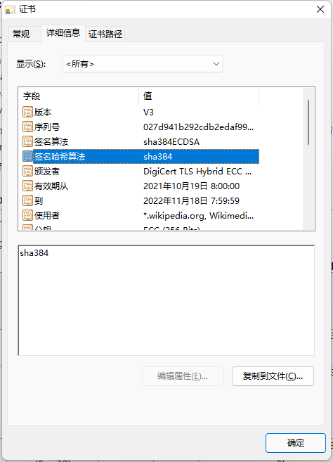
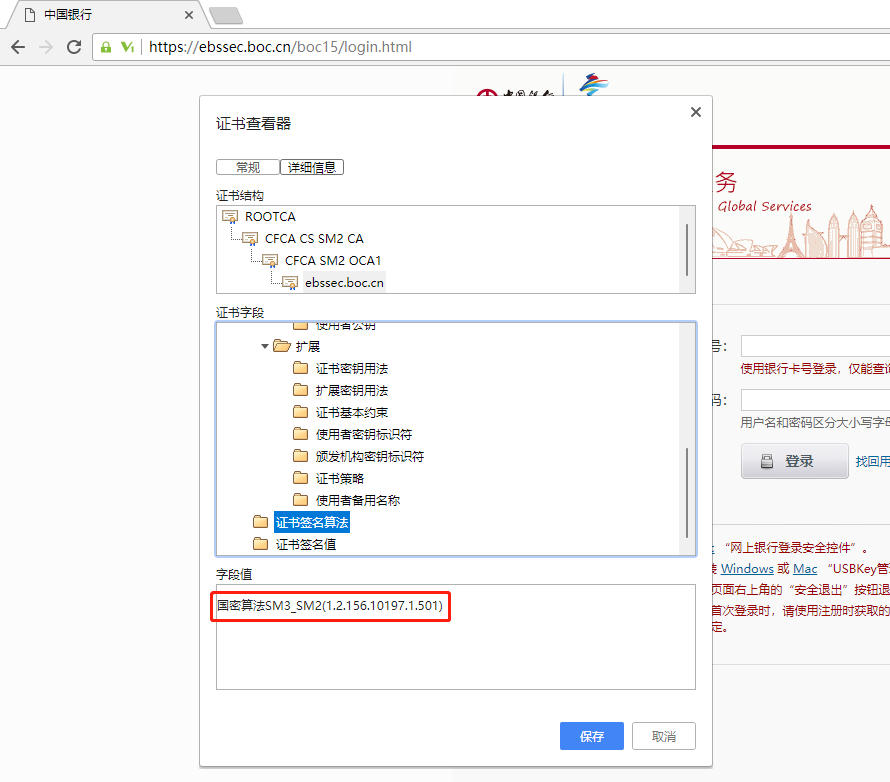

# HASH 、MD、SHA、MAC、HMAC、SM3 


## 摘要

​	本文主要讲述一些hash、摘要算法相关的概念，算法具体的实现将不会涉及。阅读完本文你将会了解HASH、MD、SHA、MAC、SM3这些术语的概念。


## 哈希函数、摘要算法

​			从理解上来说，两者是一样的。都是把一系列的二进制数据映射成一串固定大小的值。这一串固定大小的值可称之为 `哈希值` 、 `散列值` 、`散列码` 、`摘要值` 。这个过程使用的函数可以称之为`哈希函数` 使用的算法为`摘要算法`。

​		计算出来的这个值可以被认为是唯一的，并且是不可逆的，就是你不能从计算出来的码值反推出源数据。这样的话。这种函数算法就用了很多用处。比如校验文件的完整性、数字指纹、数字签名、一些密码算法的参与。本文就将介绍几种摘要算法（MD、SHA、MAC、SM3）


## MD	

​		现在MD(`Message Digest`)算法一般都是MD5算法，其它的MD算法都相应已过时。输入数据给MD5算法，最终结果是产生一个`128bit`的值，这就是md5算法。但是呢，这个算法存在许多漏洞并且已经被破解，出现了`哈希碰撞`（能够找不同的原数据有相同的hash值）这边不再符合密码学领域hash函数的要求。但是由于MD5算法计算速度较快，在今天MD5算法依然在安全性要求较低的领域依然发挥的广大的作用，比如校验数据的完整性、一些数据的分区等。


## **SHA**

​	全称为 `Secure Hash Algorithms` ,安全的hash的算法。是基于MD4算法实现的。其中有`sha-1`、`sha-2` 、`sha-3`，其中sha-1已经被发现哈希碰撞变得的不安全了。

SHA1哈希函数输出160bit数据。

SHA2方法包含*SHA-224*, *SHA-384*, *SHA-512/224* and *SHA-512/256*. 其中后面的数字就是hash函数输出数据的大小。

SHA3方法包含*SHA3-224*、*SHA3-256*、*SHA3-384*、*SHA3-512*   

SHA系列的算法比较安全了，就可以应用安全领域了。比如说数字证书。



有时候也会用于下载的完整性校验


## SM3

​		SM3算法是国产hash算法，由中国科学家王小云领头设计。SM3可用于数字签名以及认证、随机数生成。安全性和效率与SHA-256相当，有设计复杂安全性甚至超过了SHA-256算法。

SM3 输出的摘要长度为256bit，现在已经应用到国密SSL中。




## MAC

​		MAC的全称为 `message authentication code`。其实就是一个码值，这个码值用来校验消息来自理想的发送者和完整性。由于要校验要来自理想的发送者，这样的话就会使用到一个密钥`key`,这个key发送者和接收者都是知道的。

​		大致的使用流程如下。发送者利用要发送的消息和密钥生成一个码值（message+key=code）, 当然这个key接收者也知道。发送者把这个code和message都发送到接收到。接收者以同样的方式来计算code，最后两个code相互比较来校验消息有没有被伪造和丢失。


​		


​	MAC算法的实现可以使用 Hash函数进行实现。（HMAC、UMAC、VMAC ) ，也可以使用分组加密算法实现（OMAC、CCM、GCM等）。最快的还是Hash算法的实现。


## HMAC

​		`HMAC`是一种使用hash算法实现的`MAC`的算法。`HMAC`算法并没指定所需要的是哪一种hash函数，所以就可以组合不同的hash函数，以`HMAC-X`的方式进行命名，比如`HMAC-SHA256` or `HMAC-SHA3-512`or`HMAC-SM3`。

​		下面就用java的BC包进行演示不同的HASH算法在HMAC上的应用。

```java
        //任意长度的密钥key
        byte[] key = new byte[]{1,2,3,4,5};
        byte[] src = "人生若只如初见".getBytes(StandardCharsets.UTF_8);

        //使用的hash函数
        Digest mg = new MD5Digest();
//        Digest mg = new SHA256Digest();
//        Digest mg = new SM3Digest();
        HMac hMac = new HMac(mg);
        hMac.init(new KeyParameter(key));
        hMac.update(src,0,src.length);
        //使用不同的hash算法hash结果长度不同
        byte[] hmac_result = new byte[hMac.getMacSize()];
        hMac.doFinal(hmac_result,0);
        System.out.println("HMAC-MD5结果为："+ Hex.toHexString(hmac_result));
//        System.out.println("HMAC-SHA-256结果为："+ Hex.toHexString(hmac_result));
//        System.out.println("HMAC-SM3结果为："+ Hex.toHexString(hmac_result));
```


结果为

```tex
	HMAC-MD5结果为：	3373f2a38ce7e70150bc1c22f2cf9309
	HMAC-SHA-256结果为：83060f6ba9442f4835faa34091853ca7edf476b1050252c7d40fdec1c9397b17
	HMAC-SM3结果为：	7d361356552767b0d0b8e1cea2adf75047edfbde7b83e39f2982beef965eca38
```


