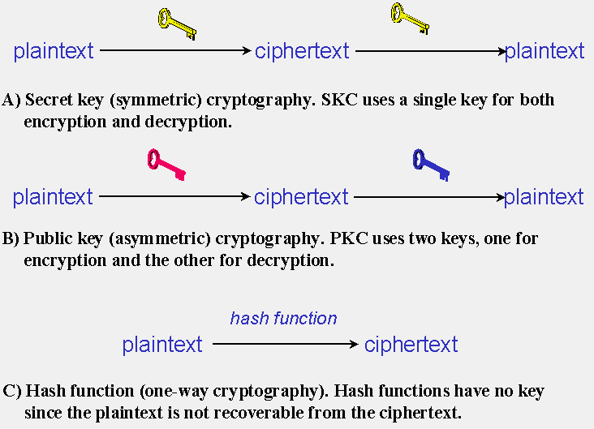

## 加密相关算法讲解


## 概述

​		本文将带你了解一些常见的加密算法和一些概念，比如：非对称加密、公钥加密、对称加密、密钥加密、分组加密、流加密、DES加密、AES加密、ECC加密、RSA加密等等。加密解密算法对于密码学体系来说，是最基础的操作，是实现一些操作的基本单元。

​		加解密的操作主要用于通讯，传递信息的信息不想被其他人知道，从来如此，以前多用于军方通讯。如今随着技术的发展和互联网盛行，人人之间通讯和人与第三方平台通讯大大增加，所以加密更多应用于我们的日常生活。 我们主要从两大块开始进行讲解那就是：`对称加密`、`非对称加密`。值得一提的是还有一种加密但是不能解密的算法就是[Hash算法](https://blog.csdn.net/tianpengfei123/article/details/123947217)。




https://www.garykessler.net/library/crypto.html#types

+ ​    对称加密：就是`明文`加密成`密文`和`密文`解密成明文使用的同一个密钥。主要用于信的隐秘性。

+ 非对称加密： 有两个密钥，一个密钥加密信息成密文，有且只能用另一个密钥解密成明文，主要用于认证、防抵赖和密钥交换

+ ​    [哈希函数](https://blog.csdn.net/tianpengfei123/article/details/123947217)： 使用特性算法把信息加密成简短的一段密文，这种加密不可逆。多应用于完整性的校验。

  


​	

## 对称加密

​		对称加密(`symmetric encryption`)可以称作：密钥加密(`Secret key cryptography`)。对于对称加密来说，这个唯一的密钥需要被信息的发送者和信息者提前知道，让这双方都知道这个相同的密钥就不得不通讯，但是通讯没有使用加密又不安全，仿佛就变成一个悖论（这就需要我们的非对称加密了），后面会讲解，在本文章我们将了解几种常用的对称加密算法。

​		其实对称加密我们还能划分为两大阵营：**流加密**（`stream ciphers`）和**分组加密**（ `block ciphers`）。

### **流加密**

​	https://www.esat.kuleuven.be/cosic/publications/thesis-167.pdf

​			流加密包含一个状态更新函数和一个输出函数。流加密的时候会有一个状态`state`会在加密的过程中不断更新，输出函数会根据这个状态`state` 生成一个`keystream`（其实是一个bits），当然`keystream`也是在不断更新的。明文 不同位置的`bits` 会有不同的`keystream`进行加密（怎么加密？例如异或操作）。 上面说的这个状态`state`必然有初始状态（`initial state`）存在，这个初始状态是怎么来的呢？通常有两种方式，第一种直接就是以key来生成初始状态，第二种是使用key和初始向量（`IV`）来生成初始状态。	

​		根据状态函数的更新方式还可以划分不同的流加密 ，如果状体更新不依赖我们发送的消息 称之为`同步流加密`（` synchronous stream cipher`）；如果状态的更新依靠的是前N- bit的密文的话我们会称之为`非同步流加密`（`asynchronous` or `self-synchronizing stream cipher`）。也有不属于两者的流加密（比如，可以依照明文进行状态的更新）。

必要常用的流密码 为`ChaCha`，RC4, A5/1, A5/2, Chameleon, FISH, Helix, ISAAC, MUGI, Panama, Phelix, Pike, Salsa20, SEAL, SOBER, SOBER-128, WAKE.


### **分组加密**

​	分组就加密就是把信息分成固定大小的块,然后对每一块进行加密。分组加密有不同的操作模式可以被选择，我们通过不同的操作方式对分组加密进行讲解。

加密的时候又有不同的加密算法。下面我们将了解一下加密模式，然后大致过一下有名的加密算法。

#### 操作模式

+ ECB模式（`Electronic Codebook` ）：这种模式就是首先把明文分成一块一块的，每一块大小相同，然后对每一组使用密钥进行加密生成密文快。这样会有一个问题，就是相同的明文块加密后的结果是相同的。这样的话很容易被插入攻击（直接在密文上删除一个密文块）和删除攻击（直接在密文上删除一个密文块）。

  ECB加密图：

  

  ECB解密图：

  

+ CBC模式（`Cipher Block Chaining`）： 这个是带有反馈机制的加密，怎么个反馈机制呢？就是之前的加密后影响我当前的加密。首先呢我们想要加密当前明文块，这时候我们就把上一把的明文块对应的密文块与当前的明文块做异或操作，生成的结果在进行加密进而生成当前明文块的密文块。一般来说第一个明文块加密的时候没有上一次的密文块，我们怎么办呢？**这时候我们可以初始化一个向量。使用这个向量与第一个明文块做异或操作**。

  很明显CBC模式由于它的关联性避免了删除攻击和插入攻击。

  https://en.wikipedia.org/wiki/Block_cipher_mode_of_operation

  **CBC加密图**

  

  

  **CBC解密图**

  
  
  
  
+ **PCBC模式（Propagating cipher block chaining)**

  和CBC差不多,就是在加密之前对明文块多做了一次异或处理. PCBC对明文做的处理为:

  >  处理结果 = 明文块`xor` 上一次明文块`xor`上一次密文快

  PCBC加密图:

  

  PCBC解密图:

  

   

  

+ *Cipher Feedback (CFB)*

  把分组加密转化为流加密，略。

+ *Output Feedback (OFB)* 

  把分组加密转化为流加密，略。

+ *Counter (CTR)* 

  把分组加密转化为流加密，略。

+ 具体的分组加密


#### 具体的加密算法

+ DES

    	全称为`Data Encryption Standard`。它把数据分割为一个个`64bits`的块，密钥为`56bits`。由于密钥太短，当前计算机的算力都很高，暴力破解变得不是难事。`2^56`的密钥尝试去暴力破解出当前的密钥。 变得不是很安全将被`AES`所替代。

+ 3DES

  ​      https://nvd.nist.gov/vuln/detail/CVE-2016-2183

  ​     由于DES可以收到暴力破解， 人们就在DES的基础上做了一次升级，使用三个密钥(K1,K2,K3)对明文块进行DES加密。加解密如下

  **加密公式**（E为加密的意思，D为解密的一次，ciphertext代表密文）：

  ​                                                                                          

     对明文使用K1进行一次加密，然后对结果使用K2进行解密，然后再对结果使用K3进行一次加密

  **解密公式**

  

  DES和3DES被爆出安全漏洞，在今后会逐渐被AES所替代

  

+ AES

  ​     AES全程为`Advanced Encryption Standard`，AES 是基于`代换-置换网络`（`Substitution-Permutation Network`）设计的，安全性较高。加密时候会以密钥和明文作为输入到网络中，在网络中做多次代换操作和置换操作产生密文块。

  ​    对于AES加密的时候对于密钥长度有三种不同的选择，`128`、`192` 、`256` bits。但它们在加密分组的时候块大小都为`128 bits`。

  

+ SM4

  国密对称算法。分组的块大小为`128bit`,密钥的长度为`128bit`。基于32轮非线性迭代结构、S盒实现。安全性较高。

   

#### Padding

​		有时候我们的分组加密，在分块的时候，最后一块是不满足固定长度的时候这就需要填充。对于ECB和CBC来说如果最后一块满足固定长度的话填充不填充都可以，如果不满足指定长度的话，不去填充就会报错无法加密。对于CFB、OFB和CTR填充不填充都可以，因为最后转化成流加密，不影响加密，这三种模式感觉也没人去填充意义不大。

​		下面我们简单介绍几种常用的填充规则。

**PKCS#5 and PKCS#7**

这两种是我们在分组加密的时候最常用，属于**字节填充**，这两种原理其实是一样只是针对块的大小不一样。

首先呢，填充的单位都是字节byte，还有一点为了**防止填充的字节和源数据造成混乱**，就是无论最后一个块够不够都得填充，如果最后一块够指定长度，那就在填充一整块。我们详细看下面。

如果最后一块缺一个字节，填充：

```tex
01
```

缺两个字节

```tex
02 02
```

缺三个字节

```tex
03 03 03
```

最后一块不缺字节，那就是缺一整块（假设一张块是16byte），那就填充16个0F

```tex
0F 0F 0F 0F 0F 0F 0F 0F 0F 0F 0F 0F 0F 0F 0F 0F
```


也就是说填充的每一个字节的数值，代表了这次填充的个数（字节为单位）。

在 PKCS#7的描述公式如下

```tex
 	     01 -- if lth mod k = k-1
	  02 02 -- if lth mod k = k-2
         .
         .
         .
k k ... k k -- if lth mod k = 0
```

`lth` 为加密的字节长度，k为块的字节长度。 k是>1的并且k最好小于256，这样的话填充函数才能更好的执行https://tools.ietf.org/html/rfc5652#section-6.3。

`PKCS#5` 只针对块的为8字节定义的，从某种角度说`PKCS#7` 的填充包含了`PKCS#5`的 。


**Zero Padding**

​		就是直接添加全是0的**字节**，以达到块的大小。这种填充很可能造成混淆。所以说，如果想要使用这种填充的话，要不就是知道源数据本来的长度，要不就是结尾有特殊标志（比如字符串）。要想使用这一种填充方式，加解密协商好即可。java平台实现字符串的`Zero Padding`的话可以基于`No Padding`包裹一层实现https://blog.csdn.net/OrangeJack/article/details/82913804。


**其他Padding**

略


## 非对称加密


非对称加密（`asymmetric cryptography`） 也称之为公钥加密（`Public-key cryptography`）。

总结来说就是会有一对密钥（公钥和私钥），把其中的公钥公开，而私钥只有自己知道。数据的加密是由`公钥`加密，有且只有对应的`私钥`进行解密。

假如我有一对密钥，把其中的公钥公开，谁想给我发消息就用这个公钥加密然后发给我。非对称加密应用有很多重要的应用，其中包括**数字签名**、**密钥协商**等。本部分简单介绍两种非堆成加密的算法（`RSA`、`ECC`），非对称详细应用请转到相对应文章。


