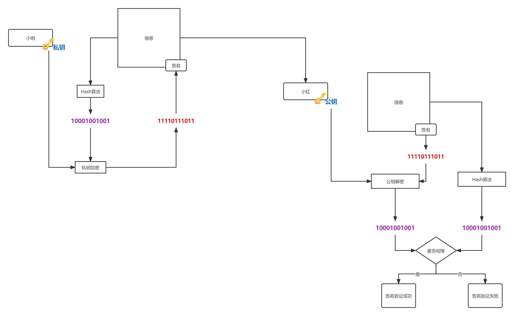
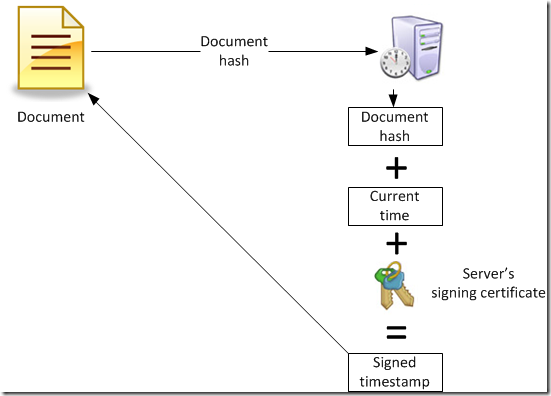
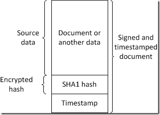
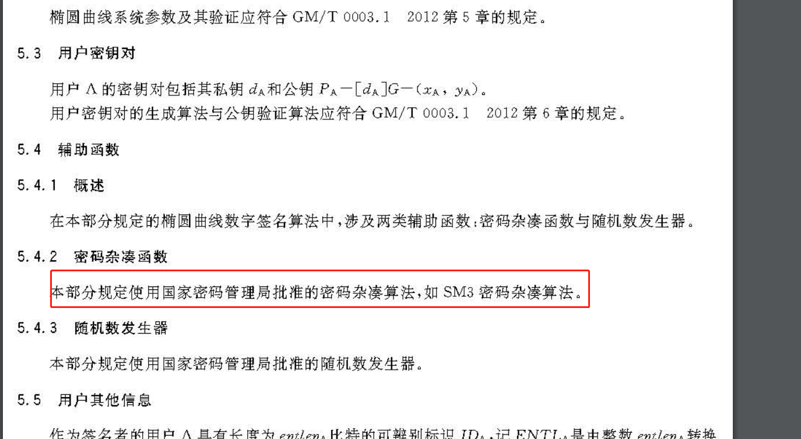

# 公钥加密应用-数字签名


## 概述

​		本文主要带大家详细了解数字签名的一些知识，数字签名利用了那些算法（非对称加密算法，hash算法），数字签名可以应用于电子签名。数字签名的作用：身份认证、完整性校验、不可抵赖性。数字签名的撤销等


## 私钥加密

​	在非对加密的算法中，我们都是利用公钥加密的，其实也可以利用私钥进行加密（数学等式做支撑，就像公钥加密一样）。私钥加密的话这时候只能公钥进行解密了，这就是签名的本质原理。 私钥直接对信息的加密的值也可以认为是签名，也可以hash信息一下在加密生成签名。


## HASH算法


先说一下一个常见的对于签名的攻击：存在性伪造。这种伪造攻击对于`one way trap door function`签名（RSA实现的签名属于此类签名）来说是有效的。加入hash算法可以有效防止这种攻击。也就是在签名前对消息进行过hash，然后对hash值利用私钥进行签名 。

```tex
   m
   ⬇
z=hash(m)
   ⬇
 sign(z)//私钥加密
   ⬇
  tag
```


签名中加入hash算法的其他好处[^1]

+ 高效性

  信息更短，更加高效

+ 兼容性

  hash算法可以转化成你想要的格式，兼容了一下私钥加密算法

+ 完整性

  hash算法可以校验完整性


我们现在一般认为签名算法包含了hash算法。


## 签名算法的使用流程

当小明使用签名要给小红发送一封重要消息的时候。下图为这个发送过程。




首先，小明对信息进行hash算法的到摘要值，然后对这个摘要值进行私钥加密。加密的结果就是`签名`，然后把签名附着在信息上发送给小红。

小红怎么验证签名值呢？小红首先对信息进行`hash`得到`摘要值`，然后对接收到签名使用公钥进行解密的`解密值`。然后对`摘要值`和`解密值`进行比较。如果相等则说明签名验证成功，如果不相等则说明签名验证失败。


## 签名算法的应用

### 认证身份

私钥只有指定的签发者知道，签名只能由此签发者知道，也只有他才能签名。公钥是公开的，有公钥就能验证签名，所以来说这就保证信息的来源的可靠。


### 完整性

当消息被修改，签名就立马失效，无法验证通过。签名算法使用着hash算法，它本身可以保证消息的完成性。


### 不可抵赖性

不可抵赖性是指的是，只要签发的信息，可以被公钥验证而且在签发时间公私密钥对没声明撤销，签发者就不能抵赖签发了此消息。


## 撤销签名密钥

​		当密钥发生泄漏了怎么办，我们是可以撤销的，可以提供在线查询哪些密钥对撤销了。怎么保证泄露之前的签名值可用呢？就是在签名中加入时间戳。


举一个栗子关于证书里面签名的[^2]




（信息的`hash`值+ 当前时间）私钥加密 = 时间戳。（图中的签名不包括hash，所以我们这里直接写成私钥加密） 

验证的时候我们能使用公钥解密出当前信息的hash和时间戳，能进行时间的对比。下图为信息和相对应的签名的组合




## 签名算法


### DSA算法

全称：`Digital Signature Algorithm`（里面含有非对称加密算法的）， 一种签名算法。由于安全性的原因已经不能签发签名了，但还可以验证之前签发的签名。[^3]

### ECDSA算法

使用椭圆曲线算法模拟实现DSA算法。

### ECDSA--SM2签名算法





一般SM2的签名算法，大家使用的hash函数是SM3 。下面是java的BC包实现SM2签名的部分代码。可以看出使用的hash算法

```java
 public SM2Signer(DSAEncoding encoding)
 {
        this.encoding = encoding;
        this.digest = new SM3Digest();
  }
```

 


## Reference 


[^1]:[Digital_signature#Method](https://en.wikipedia.org/wiki/Digital_signature#Method) "There are several reasons to sign such a hash (or message digest) instead of the whole document."
[^2]:[Signature lifecycle and timestamping](https://www.sysadmins.lv/blog-en/digital-signatures.aspx) "生成过程"

[^3]:[Digital Signature Algorithm](https://en.wikipedia.org/wiki/Digital_Signature_Algorithm) "A draft version of the specification FIPS 186-5 indicates DSA will no longer be approved for digital signature generation, but may be used to verify signatures generated prior to the implementation date of that standard."


