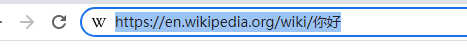
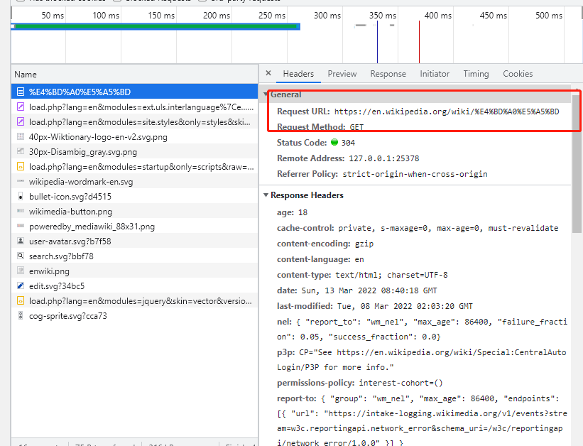
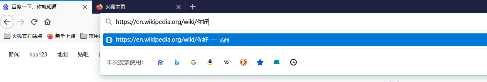
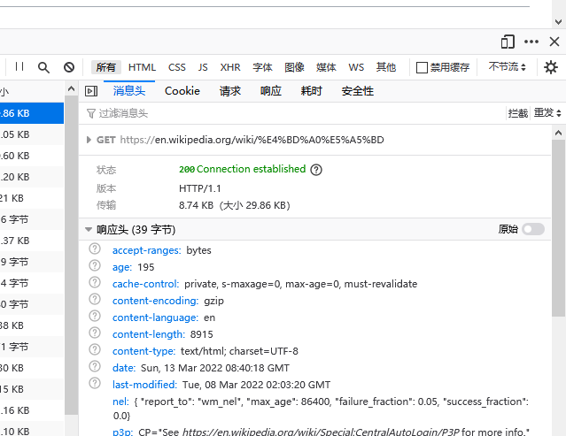
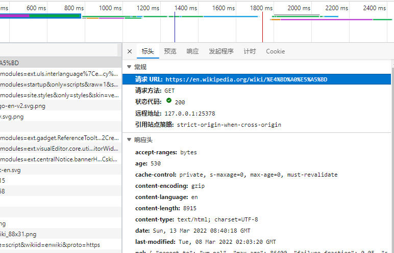
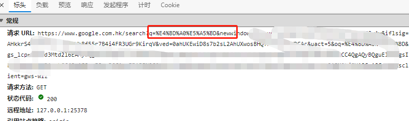
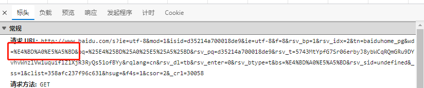

## 摘要

让你理解当前URL编码的规则


## URL编码

​		

​		我们在的HTTP请求的地址就是一种URI，为了通用性的考虑 URI所包含的部分被限制在了拉丁字母、数字、还有一些特殊的符号[^1]。URI中有一些特殊含义的字符比如 `/` `?` 等都是有特殊含义，这时候我们会遇见一个问题，那就是如果我们传输一些在限制之外或者恰巧是特殊的字符怎么办呢？ 

​		这时候就需要我们的URL编码，也称之为百分号编码（`Percent-encoding`），应用于URI （URI包含URL和URN），有时候也应用于请求体格式为`application/x-www-form-urlencoded`的请求，看名字就知道被应用URL编码了。

​	

URL编码就是找到你要编码的字符对应底层的16进制，然后再在前面加一个 百分号（`%`）。比如：`%`将会编码成 `%25`  `a`将编码成`%61` 。

​		对于字符在URL编码中分为下面的三种情况：1.保留字符 2.非保留字符 3.其他字符

1. 保留字符

   ```tex
   ␣	!	#	$	%	&	'	(	)	*	+	,	/	:	;	=	?	@	[	]
   ```

   这些字符在URI都会有特殊含义比喻`?`后边就会传输一些查询参数。这字符会按照上面的转换标准进行转换。 底层16进制使用的`ACSII`，`%61`和传输`a`效果是一样的

   

2. 非保留字符

   URI中允许存在但不是保留字符就是非保留字符了。非保留字符不用去进行URL编码，如果用了，接收方一般也是可以支持解析的。

   

3. 其他字符

   除了以上两种字符便都是其他字符，比如 `你`、 `好`。由于上一版[^3]使用的规定没有提到对这些字符使用什么字符集进行URL编码，这导致在一段时间内"URL编码"成为了一个混乱的领域[^2]。今时不同往日了，新的标准已经制定了多年了，大家也已经都按照这个标准来了。里面就规定了 我们使用字符集UTF-8编码[^4]，现在URL编码并不象之前那么混乱了。比如`你好`对应16进制(`UTF-8`)显示 `E4BDA0E5A5BD` 

   
   
   + 在google浏览器 维基百科上查询
   
   
   
   ​	浏览器返送的请求是这样
   
    
   
   
   
   + 火狐上查询
   
     

	
	+ ME浏览器路浏览器同样效果
	
	  
	
	+  分别使用google和百度搜索`你好`是什么效果
	
	  
	
	  
	
	


## reference

[^1]: RFC [3986](https://datatracker.ietf.org/doc/html/rfc3986#section-1.2.1)	"A URI is a sequence of characters from a very limited set: the letters of the basic Latin alphabet, digits,and a few special characters"

[^2]: [阮一峰Blog](http://www.ruanyifeng.com/blog/2010/02/url_encoding.html) "RFC 1738没有规定具体的编码方法，而是交给应用程序（浏览器）自己决定。这导致"URL编码"成为了一个混乱的领域。" 

[^3]: RFC [1738](https://datatracker.ietf.org/doc/html/rfc1738)

[^4]: RFC [3986](https://datatracker.ietf.org/doc/html/rfc3986#section-2.5)	" When a new URI scheme defines a component that represents textual data consisting of characters from the Universal Character Set [UCS],the data should first be encoded as octets according to the UTF-8 character encoding"


