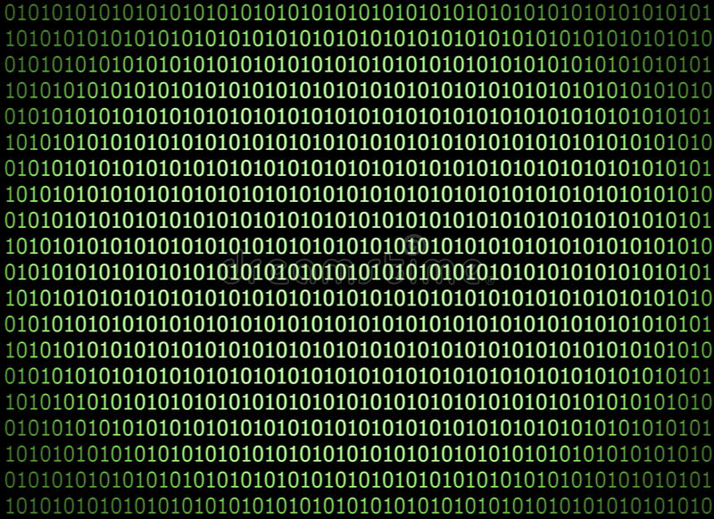
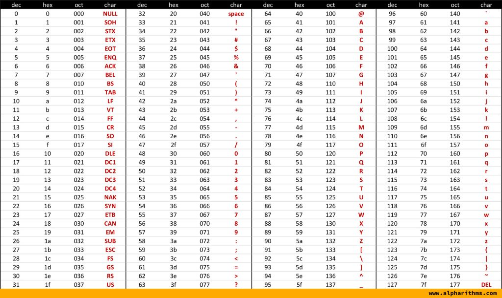
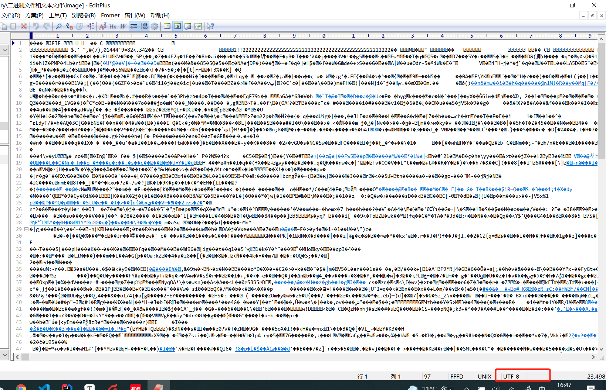

# 计算机中的二进制、 字符编码、字符集、  二进制文件、  文本文件 	

​	

## 简介

​		文本可以让你理解 计算机中为什么要使用二进制？我们存储的文件到底是什么？什么是字符集？什么是字符编码？什么是二进制文件？什么是文本文件？

​			**首先先明确一个概念，你现在电子产品中看到和听到的所有数据一切皆为二进制数据，底层都是0 1来表示的。**

## 为什么是二进制

​		为什么要用0 1表示呢，因为0 1 表示是最简单最普适的方法。我们的数据最终是要寄存到物理设备的上，或者说数据一直在物理设备上的。物理设备描述0，1是最简单的。举例说明:

​		磁盘会根据的磁性材料的磁性分别来代表0或者1，固态硬盘使用它里面包含的栅的导电性的不同来来代表0和1 。我们再看信息传输过程中的是怎么实现的，一般使用电缆或者光缆进行传输。电缆和光缆分别是利用电压特性和光学特性来传输二进制数据的，比较复杂。**总之在这个世界上物理元器件比容易描述两种状态，进而更加容易代表二进制**。也就是说你存储的数据就是这些物理状态。这种使用二进制数据的计算机也称之为二进制计算机，当然也有一些人在尝试设计计算机使用其他进制的数据，据说可以大大加快运算速度。

## 二进制怎么代表我们的信息

​		我们现在知道信息都是二进制的信息，我们怎么才能利用二进制来携带我们想要的信息呢？这里面需要两方面的支持，一是把我们拥有的数据转化为二进制，第二点是把这些二进制翻译成我们想要的数据方式展现（也就是可阅读）。

​		

​		

​	

​		比如我们利用手机拍摄一张图片这个过程。我们把眼前的环境转化为二进制的数据，然后手机可以利用这些二进制的信息来操作屏幕上的二极管进而操作颜色明暗等信息，最终把数据渲染成显示的图片，声音、文字也都是一样的。由此可见这种转换势必会存在一种转换规则，不同的二进制的数据代表不同的操作。

## 字符的翻译

​		文字对于人类记录、传递信息太重要了，我们首先是想要把文字转化为二进制，来进行记录和传递信息。所以我们就需要根据我们自己的需要构建一套文本 二进制之间的翻译机制，我可以粗略的认为字符翻译到二进制的动作或者过程叫做**字符编码**，这一套翻译规范可以称之为**字符集**

### 字符集-ASCII

美国首先就设计一种二进制翻译字符的机制：`ASCII` ，全程为` American Standard Code for Information Interchange`,它使用8位的二进制（8bit 或者称之为一个字节），不同数值来代表不同字符，2^8=256,一共有256个字符被代表。

​	`ASCII`代表的字符只是把英文世界的字符代表了，但是世界上有这么多文字，随着各国的发展进入互联网的世界。就不得不重新定义统一的翻译规则（编码规则），这时候就出现许多编码规则其中一种是名为`UTF8`的`Unicode`（包含所有国家地区的字符）编码，在编程过程中大家一般都统一使用这种编码规则。**`Unicode`编码兼容ASCII**,基本所有其他编码都会兼容`ASCII`。

## 二进制文件和文本文件

**物理层面所有的文件都是二进制，进一步说计算机中所有的数据都是二进制。**我们通常认为把用某一种字符编码规则存储字符的文件称之为文本文件。其他文件位二进制文件。（**由此可见文本文件只是一种特殊的二进制文件，从逻辑的角度理解是文本文件**）加入我们把二进制文件比如图片，强行用字符规则**翻译**的话我们看什么情况。

很明显乱七八糟，无法把他显示成我们想要的字符格式，本质的原因他就不是用来表示字符的，肯定不是用字符的编码来生成文件的，翻译过来肯定是乱七八糟。其实我们可以这样理解使用字母编码规则生成的文件我们可以认为是文本文件，不是的话称之为二进制文件。

�代表无法识别的字符。

